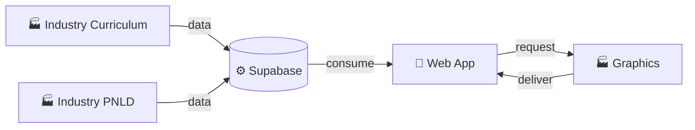

# Profeplan - Holding Industrial de Software 🏭

> **Arquitetura Orientada a Serviços**: Uma Loja alimentada por Indústrias especializadas.

## 🎯 Visão Geral

O Profeplan é um **Monorepo Industrial** que separa responsabilidades entre:

- 🏪 **A Loja** (`apps/web`): Interface do usuário, experiência, atendimento
- 🏭 **As Indústrias** (`packages/`): Processamento de dados, ETL, validação
- ⚙️ **A Logística** (`infra/supabase`): Banco de dados centralizado



---

## 📁 Estrutura do Projeto

```
PROFEPLAN/
├── apps/
│   └── web/                      # 🏪 Frontend React/Vite
│       ├── src/
│       ├── public/
│       └── package.json
├── packages/
│   ├── industry-curriculum/      # 🏭 Processamento BNCC + SEEMG
│   │   ├── src/
│   │   ├── data/
│   │   └── requirements.txt
│   ├── industry-pnld/            # 🏭 Normalização de Livros
│   │   ├── src/
│   │   ├── data/
│   │   └── requirements.txt
│   └── graphics-profeplan/       # 🏭 Geração de Documentos
│       ├── src/
│       ├── templates/
│       └── requirements.txt
└── infra/
    └── supabase/                 # ⚙️ Banco de Dados
        └── migrations/
```

---

## 🚀 Quick Start

### Frontend (Desenvolvedor)

```bash
cd apps/web
npm install
npm run dev
# Acesse http://localhost:3000
```

### Indústrias (Administrador)

```bash
# Industry Curriculum
cd packages/industry-curriculum
python -m venv venv
source venv/bin/activate  # Windows: venv\Scripts\activate
pip install -r requirements.txt
python src/pipeline_mg.py

# Industry PNLD
cd packages/industry-pnld
python -m venv venv
source venv/bin/activate
pip install -r requirements.txt
python src/normalizer_pipeline.py

# Graphics
cd packages/graphics-profeplan
python -m venv venv
source venv/bin/activate
pip install -r requirements.txt
python src/document_generator.py
```

---

## 🏭 As Indústrias

### 1️⃣ Industry Curriculum (Ground Truth)
**Função:** Processa PDFs da BNCC e SEEMG em dados estruturados

- **Input:** PDFs do planejamento trimestral (MG)
- **Output:** Dados validados em `curriculos_mg` (Supabase)
- **Tecnologia:** Python, Gemini AI, Guardrails (validação BNCC)
- **Quando roda:** Offline (batch, noturno)

### 2️⃣ Industry PNLD (Refinaria)
**Função:** Normaliza livros didáticos de múltiplas editoras

- **Input:** PDFs de livros (FTD, Moderna, etc.)
- **Output:** Metadados normalizados em `pnld_livros` (Supabase)
- **Tecnologia:** Python, Gemini AI, ISBN Validator
- **Quando roda:** Offline (batch)

### 3️⃣ Graphics Profeplan (Gráfica)
**Função:** Gera documentos profissionais (DOCX/PDF)

- **Input:** JSON com dados do planejamento
- **Output:** Documentos DOCX/PDF formatados
- **Tecnologia:** Python, python-docx-template, WeasyPrint
- **Quando roda:** On-demand (quando usuário solicita)

---

## 🏪 A Loja (Frontend)

**Função:** Interface do usuário, experiência, visualização

- **Tecnologia:** React, TypeScript, Vite, TailwindCSS, Capacitor
- **Consome:** Dados pré-processados do Supabase
- **NÃO faz:** Processamento pesado, ingestão de PDFs, validação de dados

### Princípio Just-in-Time

```
❌ ANTES: Usuário → Frontend processa PDF → Exibe
✅ AGORA: [Offline] Indústria processa → [Runtime] Frontend lê e exibe
```

---

## ⚙️ A Logística (Supabase)

**Função:** Armazenamento centralizado, VectorDB, autenticação

- **Tabelas principais:**
  - `curriculos_mg`: Dados curriculares processados
  - `pnld_livros`: Metadados de livros normalizados
  - `term_plans`: Planejamentos criados pelos professores
  - `pdi_documents`: PDIs (Planos Individuais)

---

## 📚 Documentação

- [Integration Guide](file:///c:/Users/Admin/.gemini/antigravity/brain/78d10747-bec6-4cbf-a447-9c608c47aeec/integration_guide.md) - Como conectar Loja ↔ Indústrias
- [Implementation Plan](file:///c:/Users/Admin/.gemini/antigravity/brain/78d10747-bec6-4cbf-a447-9c608c47aeec/implementation_plan.md) - Fases da migração
- [Walkthrough](file:///c:/Users/Admin/.gemini/antigravity/brain/78d10747-bec6-4cbf-a447-9c608c47aeec/walkthrough.md) - Histórico de mudanças

### READMEs Específicos

- [Industry Curriculum](file:///c:/Users/Admin/PROFEPLAN/PROFEPLAN/packages/industry-curriculum/README.md)
- [Industry PNLD](file:///c:/Users/Admin/PROFEPLAN/PROFEPLAN/packages/industry-pnld/README.md)
- [Graphics Profeplan](file:///c:/Users/Admin/PROFEPLAN/PROFEPLAN/packages/graphics-profeplan/README.md)

---

## 🛠️ Comandos Úteis

```bash
# Raiz do Monorepo
npm run dev          # Inicia frontend
npm run build        # Build de todos os workspaces
npm run lint         # Lint em todos os workspaces

# Frontend específico
cd apps/web
npm run dev          # Dev server (porta 3000)
npm run build        # Build de produção
npm run preview      # Preview da build

# Supabase
cd infra/supabase
supabase status      # Status do DB local
supabase start       # Iniciar DB local
supabase stop        # Parar DB local
```

---

## 🔐 Variáveis de Ambiente

Cada componente tem seu próprio `.env`:

```bash
# apps/web/.env
VITE_SUPABASE_URL=your_supabase_url
VITE_SUPABASE_ANON_KEY=your_anon_key
VITE_GEMINI_API_KEY=your_gemini_key

# packages/industry-curriculum/.env
GEMINI_API_KEY=your_gemini_key
SUPABASE_URL=your_supabase_url
SUPABASE_KEY=your_service_key

# (Similar para industry-pnld e graphics-profeplan)
```

---

## 📦 Tech Stack

### Frontend
- React 18 + TypeScript
- Vite (Build tool)
- TailwindCSS (Styling)
- Capacitor (Mobile)
- Supabase Client

### Backend/Indústrias
- Python 3.11+
- Google Gemini AI
- Supabase (PostgreSQL + VectorDB)
- python-docx-template (Documentos)

### Infra
- Supabase (PostgreSQL, Auth, Storage, VectorDB)
- Row Level Security (RLS)

---

## 🎓 Filosofia da Arquitetura

### Por que "Industrial"?

Assim como uma fábrica divide produção em linhas especializadas, o Profeplan divide responsabilidades:

| Conceito Industrial | No Profeplan |
|---------------------|--------------|
| Matéria-prima | PDFs (currículo, livros) |
| Linha de produção | Indústrias (Python pipelines) |
| Controle de qualidade | Guardrails, validadores |
| Estoque | Supabase (dados processados) |
| Loja | Frontend (interface do usuário) |

### Benefícios

✅ **Escalabilidade**: Cada indústria pode escalar independentemente  
✅ **Confiabilidade**: Validação robusta antes de chegar ao usuário  
✅ **Performance**: Frontend leve, processamento pesado offline  
✅ **Manutenibilidade**: Código organizado por domínio  

---

**Status:** Arquitetura Completa ✅ | 5/5 Fases Implementadas

