# PROFEPLAN V5 — Plano de Implementação dos Agentes Multi-Disciplinares

> **Documento:** Plano de Migração V4 → V5 — Camada de Agentes
> **Versão:** 1.0
> **Status:** Rascunho para revisão
> **Data:** 2026-07-09
> **Autor:** IA Arquitetura (Winston + BMAD Master)
> **Dependência:** `docs/plano-execucao-estabilizacao-migracao-azure.md`, `docs/COMPARATIVO_REPOSITORIOS.md`

---

## 1. Visão Geral

Este documento descreve o plano de implementação da **camada de agentes inteligentes** da versão 5 do PROFEPLAN, cobrindo três famílias de agentes:

| Família | Responsabilidade | Quantidade Estimada |
|---|---|---|
| **Agentes de Disciplina** | Geração de conteúdo especializado por matéria/ano | ~21 disciplinas × n anos |
| **Agentes de Coordenação** | Orquestração do pipeline multi-agente, roteamento e contexto | 3–5 |
| **Agentes de Qualidade** | Averiguação, validação e guardrails das respostas | 5–7 |

### 1.1 Objetivo da V5

Transformar o sistema de geração de um modelo monolítico de prompt único para uma **arquitetura multi-agente orquestrada**, onde cada disciplina recebe um agente especializado com:

- **System Prompt** dedicado com regras pedagógicas da matéria
- **Contexto RAG** priorizado pelo plano de curso do professor (Nível 1, peso 100)
- **Base de conhecimento** da BNCC filtrada por disciplina/ano
- **Guardrails** de não-alucinação específicos da área

### 1.2 Alinhamento com a Estratégia de Migração Azure

Este plano está alinhado ao **Trilho B (Migração Azure)** do documento `plano-execucao-estabilizacao-migracao-azure.md`. Os agentes serão implementados progressivamente junto com a migração do AiCore para o BFF Azure.

---

## 2. Arquitetura de Agentes da V5

```mermaid
graph TB
    subgraph "Camada de Entrada"
        PROF[Professor / FREEDAY]
    end

    subgraph "Orquestradores (Coordenação)"
        ORCH[🧭 Orchestrator Agent<br/>Roteador Principal]
        CTX[📋 Context Builder Agent<br/>Montador de Contexto RAG]
        SESS[🔗 Session Agent<br/>Gestor de Estado e Continuidade]
    end

    subgraph "Agentes de Disciplina"
        direction LR
        D1[📐 Matemática]
        D2[📖 Língua Portuguesa]
        D3[🌍 Geografia]
        D4[🏛️ História]
        D5[🔬 Ciências/Biologia]
        D6[⚛️ Física]
        D7[🧪 Química]
        D8[🎨 Artes]
        D9[🏃 Educação Física]
        D10[💭 Filosofia]
        D11[👥 Sociologia]
        D12[🙏 Ensino Religioso]
        D13[🇬🇧 Língua Inglesa]
    end

    subgraph "Agentes de Qualidade (Gate)"
        Q1[✅ BNCC Validator<br/>Validador de Alinhamento Curricular]
        Q2[🔍 Hallucination Detector<br/>Detector de Alucinações]
        Q3[🎯 PDI Guardian<br/>Validador de Inclusão/DUA]
        Q4[📊 Content Scorer<br/>Avaliador de Qualidade Pedagógica]
        Q5[🔒 Privacy Guard<br/>Guardião de Privacidade/Ética]
    end

    subgraph "Infraestrutura"
        RAG[(Supabase RAG<br/>vector 768)]
        AZURE[Azure OpenAI<br/>GPT-4o / GPT-35]
        GEMINI[Google Gemini<br/>Embeddings]
    end

    PROF --> ORCH
    ORCH --> CTX
    ORCH --> SESS
    CTX --> RAG
    CTX --> GEMINI
    ORCH --> D1 & D2 & D3 & D4 & D5 & D6 & D7 & D8 & D9 & D10 & D11 & D12 & D13
    D1 & D2 & D3 & D4 & D5 & D6 & D7 & D8 & D9 & D10 & D11 & D12 & D13 --> AZURE
    D1 & D2 & D3 & D4 & D5 & D6 & D7 & D8 & D9 & D10 & D11 & D12 & D13 --> Q1 & Q2 & Q3 & Q4 & Q5
    Q1 & Q2 & Q3 & Q4 & Q5 -->|🟢 Aprovado| PROF
    Q1 & Q2 & Q3 & Q4 & Q5 -->|🔴 Rejeitado| ORCH
```



### 2.1 Fluxo de uma Requisição Típica

1. **Professor** solicita um plano de aula de História, 1º Ano EM
2. **Orchestrator** recebe a requisição, identifica: `disciplina=História`, `ano=1EM`, `tipo=plano_aula`
3. **Context Builder** monta o pacote RAG:
   - Nível 1: Plano de Curso do professor (peso 100)
   - Nível 2: Livros didáticos PNLD associados (peso 50)
   - Nível 3: Materiais de enriquecimento (peso 30)
   - Nível 4: Base geral BNCC (peso 10)
4. **Orchestrator** roteia para `Agent_Historia_1Ano_{Professor}`
5. **Agente de Disciplina** gera o conteúdo com Azure OpenAI
6. **Quality Gates** validam a saída:
   - BNCC Validator: Confere códigos de habilidades
   - Hallucination Detector: Verifica invenção de conteúdo
   - Content Scorer: Avalia qualidade pedagógica
7. Se aprovado → retorna ao professor. Se rejeitado → re-itera com feedback.

---

## 3. Agentes de Disciplina (1 por Matéria)

### 3.1 Catálogo de Disciplinas

Com base no currículo de Minas Gerais (`curriculo_mg/chunks/`) e na BNCC.

> 🎭 **Convenção de nomenclatura:** Cada agente de disciplina recebe o nome de uma figura icônica da sua área de conhecimento. O nome humano **não** substitui o código técnico — ele o complementa como identidade amigável na interface e nos logs.

#### Tabela de Batismo dos Agentes

| Disciplina | 🎭 Nome do Agente | Referência |
|---|---|---|
| Língua Portuguesa | **Machado** | Machado de Assis (1839–1908), maior escritor brasileiro |
| Matemática | **Pitágoras** | Pitágoras de Samos (c. 570–495 a.C.), pai da matemática ocidental |
| Ciências / Biologia | **Darwin** | Charles Darwin (1809–1882), teoria da evolução |
| Geografia | **Milton** | Milton Santos (1926–2001), maior geógrafo brasileiro |
| História | **Heródoto** | Heródoto de Halicarnasso (c. 484–425 a.C.), pai da História |
| Artes | **Tarsila** | Tarsila do Amaral (1886–1973), ícone do modernismo brasileiro |
| Educação Física | **Pelé** | Edson Arantes do Nascimento (1940–2022), Rei do Futebol |
| Ensino Religioso | **Francisco** | Papa Francisco (1936–) / São Francisco de Assis |
| Língua Inglesa | **Shakespeare** | William Shakespeare (1564–1616), maior dramaturgo inglês |
| Física | **Einstein** | Albert Einstein (1879–1955), revolucionou a física |
| Química | **Lavoisier** | Antoine Lavoisier (1743–1794), pai da química moderna |
| Filosofia | **Sócrates** | Sócrates de Atenas (c. 470–399 a.C.), fundador da filosofia ocidental |
| Sociologia | **Durkheim** | Émile Durkheim (1858–1917), pai da sociologia |

> 💡 O batismo é compartilhado entre EF e EM — Machado rege tanto o Fundamental quanto o Médio. O sufixo `_EF` ou `_EM` no código distingue o nível, mas a persona é a mesma.

#### Ensino Fundamental II (6º ao 9º Ano)

| # | 🎭 Nome | Disciplina | Código do Agente | Anos | Base Curricular |
|---|---|---|---|---|
| 1 | Machado | Língua Portuguesa | `Agent_LinguaPortuguesa_EF` | 6º, 7º, 8º, 9º | `Ensino_Fundamental_*ANO_Língua_Portuguesa.json` |
| 2 | Pitágoras | Matemática | `Agent_Matematica_EF` | 6º, 7º, 8º, 9º | `Ensino_Fundamental_*ANO_Matemática.json` |
| 3 | Darwin | Ciências | `Agent_Ciencias_EF` | 6º, 7º, 8º, 9º | `Ensino_Fundamental_*ANO_Ciências.json` |
| 4 | Milton | Geografia | `Agent_Geografia_EF` | 6º, 7º, 8º, 9º | `Ensino_Fundamental_*ANO_Geografia.json` |
| 5 | Heródoto | História | `Agent_Historia_EF` | 6º, 7º, 8º, 9º | `Ensino_Fundamental_*ANO_História.json` |
| 6 | Tarsila | Artes | `Agent_Artes_EF` | 6º, 7º, 8º, 9º | `Ensino_Fundamental_*ANO_Artes.json` |
| 7 | Pelé | Educação Física | `Agent_EducacaoFisica_EF` | 6º, 7º, 8º, 9º | `Ensino_Fundamental_*ANO_Educação_Física.json` |
| 8 | Francisco | Ensino Religioso | `Agent_EnsinoReligioso_EF` | 6º, 7º, 8º, 9º | `Ensino_Fundamental_*ANO_Ensino_Religioso.json` |
| 9 | Shakespeare | Língua Inglesa | `Agent_LinguaInglesa_EF` | 6º, 8º* | `Ensino_Fundamental_*ANO_Língua_Inglesa.json` |

> *Nota: Língua Inglesa no EF só aparece nos anos 6º e 8º no currículo MG. Verificar disponibilidade para 7º e 9º.

#### Ensino Médio (1º ao 3º Ano)

| # | 🎭 Nome | Disciplina | Código do Agente | Anos | Base Curricular |
|---|---|---|---|---|---|
| 10 | Machado | Língua Portuguesa | `Agent_LinguaPortuguesa_EM` | 1º, 2º, 3º | `Ensino_Médio_*ANO_Língua_Portuguesa.json` |
| 11 | Pitágoras | Matemática | `Agent_Matematica_EM` | 1º, 2º, 3º | `Ensino_Médio_*ANO_Matemática.json` |
| 12 | Darwin | Biologia | `Agent_Biologia_EM` | 1º, 2º, 3º | `Ensino_Médio_*ANO_Biologia.json` |
| 13 | Einstein | Física | `Agent_Fisica_EM` | 1º, 2º, 3º | `Ensino_Médio_*ANO_Física.json` |
| 14 | Lavoisier | Química | `Agent_Quimica_EM` | 1º, 2º, 3º | `Ensino_Médio_*ANO_Química.json` |
| 15 | Milton | Geografia | `Agent_Geografia_EM` | 1º, 2º, 3º | `Ensino_Médio_*ANO_Geografia.json` |
| 16 | Heródoto | História | `Agent_Historia_EM` | 1º, 2º, 3º | `Ensino_Médio_*ANO_História.json` |
| 17 | Tarsila | Artes | `Agent_Artes_EM` | 1º, 2º, 3º | `Ensino_Médio_*ANO_Artes.json` |
| 18 | Pelé | Educação Física | `Agent_EducacaoFisica_EM` | 1º, 2º, 3º | `Ensino_Médio_*ANO_Educação_Física.json` |
| 19 | Sócrates | Filosofia | `Agent_Filosofia_EM` | 1º, 2º, 3º | `Ensino_Médio_*ANO_Filosofia.json` |
| 20 | Durkheim | Sociologia | `Agent_Sociologia_EM` | 3º* | `Ensino_Médio_3ANO_Sociologia.json` |
| 21 | Shakespeare | Língua Inglesa | `Agent_LinguaInglesa_EM` | 1º, 2º, 3º | `Ensino_Médio_*ANO_Língua_Inglesa.json` |

> *Nota: Sociologia só aparece no 3º Ano no currículo MG atual. Verificar outros anos.

### 3.2 Estrutura de um Agente de Disciplina

Cada agente de disciplina é composto por:

```
agents/disciplinas/
├── base/
│   ├── __init__.py
│   ├── discipline_agent_base.py    # Classe base abstrata
│   ├── system_prompt_builder.py    # Construtor de System Prompts
│   └── rag_context_builder.py     # Montador de contexto RAG hierárquico
├── lingua_portuguesa/
│   ├── __init__.py
│   ├── agent_lingua_portuguesa.py  # Implementação específica
│   └── prompts/
│       ├── system_prompt_EF.md     # System Prompt para Fundamental
│       ├── system_prompt_EM.md     # System Prompt para Médio
│       ├── planejamento_trimestral.md
│       ├── plano_aula.md
│       ├── avaliacao.md
│       └── pdi_adaptacao.md
├── matematica/
│   ├── __init__.py
│   ├── agent_matematica.py
│   └── prompts/
│       └── ...
├── historia/
│   └── ...
├── ... (demais 18 disciplinas)
```

### 3.3 Classe Base do Agente de Disciplina

```python
# agents/disciplinas/base/discipline_agent_base.py

from abc import ABC, abstractmethod
from dataclasses import dataclass
from typing import Optional
from enum import Enum


class TipoGeracao(Enum):
    PLANEJAMENTO_TRIMESTRAL = "planejamento_trimestral"
    PLANO_AULA = "plano_aula"
    AVALIACAO = "avaliacao"
    PDI_ADAPTACAO = "pdi_adaptacao"
    SIMULADO = "simulado"


class NivelEnsino(Enum):
    EF_6 = "6ano"
    EF_7 = "7ano"
    EF_8 = "8ano"
    EF_9 = "9ano"
    EM_1 = "1ano_em"
    EM_2 = "2ano_em"
    EM_3 = "3ano_em"


@dataclass
class DisciplinaContext:
    disciplina: str
    nivel: NivelEnsino
    professor_id: str
    turma_id: str
    plano_curso_md: Optional[str] = None    # Markdown do plano de curso
    livro_pnld_id: Optional[str] = None
    materiais_extras: list[str] = None


class BaseDisciplineAgent(ABC):
    """Classe base para todos os agentes de disciplina da V5."""

    def __init__(self, context: DisciplinaContext):
        self.context = context
        self.system_prompt = self._build_system_prompt()

    @abstractmethod
    def _build_system_prompt(self) -> str:
        """Monta o System Prompt específico da disciplina + nível."""
        ...

    @abstractmethod
    def get_disciplina(self) -> str:
        """Retorna o nome normalizado da disciplina."""
        ...

    @abstractmethod
    def get_habilidades_prioritarias(self) -> list[str]:
        """Retorna lista de códigos de habilidades BNCC prioritárias."""
        ...

    def gerar(self, tipo: TipoGeracao, parametros: dict) -> dict:
        """Fluxo principal de geração."""
        # 1. Montar contexto RAG hierárquico
        rag_context = self._build_rag_context(tipo)

        # 2. Selecionar prompt template específico
        prompt = self._select_prompt_template(tipo)

        # 3. Chamar Azure OpenAI com system prompt + RAG + prompt
        resultado = self._call_llm(prompt, rag_context, parametros)

        # 4. Pós-processar (sanitização, formatação)
        return self._post_process(resultado, tipo)

    def _build_rag_context(self, tipo: TipoGeracao) -> str:
        """Monta contexto RAG com pesos hierárquicos."""
        # Nível 1: Plano de Curso (peso 100) — OBRIGATÓRIO
        # Nível 2: Livros PNLD (peso 50)
        # Nível 3: Materiais extras (peso 30)
        # Nível 4: Base BNCC geral (peso 10)
        ...

    def _select_prompt_template(self, tipo: TipoGeracao) -> str:
        """Carrega o template de prompt .md adequado ao tipo de geração."""
        ...

    def _call_llm(self, prompt: str, rag: str, params: dict) -> str:
        """Chamada à Azure OpenAI (GPT-4o / GPT-35-turbo)."""
        ...

    def _post_process(self, raw: str, tipo: TipoGeracao) -> dict:
        """Sanitização e estruturação da saída."""
        ...
```

### 3.4 Exemplo de System Prompt por Disciplina

```markdown
# System Prompt — Agent_Historia_EM (História — Ensino Médio)

Você é um Professor Especialista em História com 20 anos de experiência no Ensino Médio
da rede pública brasileira. Você domina a BNCC, o Currículo Referência de Minas Gerais
e as diretrizes do PNLD para a disciplina de História.

## REGRAS INEGOCIÁVEIS

1. **PROIBIDO INVENTAR CÓDIGOS DA BNCC.** Todo código de habilidade citado DEVE
   existir na base documental fornecida no contexto RAG.
2. **PROIBIDO INVENTAR FATOS HISTÓRICOS.** Datas, nomes, eventos e contextos
   devem ser verificáveis nos documentos de referência.
3. **PRIORIDADE ABSOLUTA AO PLANO DE CURSO DO PROFESSOR.** Se houver conflito
   entre o plano de curso e a base geral, o plano de curso VENCE.
4. **LINGUAGEM ACESSÍVEL.** Use linguagem clara para alunos do Ensino Médio,
   evitando jargão acadêmico excessivo, mas sem subestimar a inteligência dos estudantes.

## ABORDAGEM PEDAGÓGICA

- Priorize a **contextualização histórica**: conecte eventos do passado com o presente.
- Use **fontes primárias** sempre que disponíveis no contexto.
- Estimule o **pensamento crítico**: apresente múltiplas perspectivas historiográficas.
- Promova a **interdisciplinaridade**: conecte com Geografia, Sociologia e Filosofia.

## ESTRUTURA DE SAÍDA PADRÃO

### Para Plano de Aula:
- Cabeçalho (Disciplina, Ano, Tema, Duração)
- Habilidades BNCC (com códigos verificados)
- Objetivos de Aprendizagem
- Desenvolvimento (Introdução → Desenvolvimento → Fechamento)
- Recursos Didáticos
- Avaliação
- Referências

### Para Planejamento Trimestral:
- Eixos Temáticos
- Habilidades por bimestre
- Objetos de Conhecimento
- Cronograma de aulas
```

### 3.5 Prioridades de Implementação

Os agentes de disciplina serão implementados em **3 ondas**, priorizando as disciplinas mais utilizadas:

| Onda | Disciplinas | Prazo | Justificativa |
|---|---|---|---|
| **Onda 1** | Língua Portuguesa, Matemática, História, Geografia, Ciências/Biologia | Sprint 1–2 | Maior volume de uso; disciplinas do ENEM/SAEB |
| **Onda 2** | Física, Química, Língua Inglesa, Artes, Educação Física | Sprint 3–4 | Complemento das áreas de conhecimento |
| **Onda 3** | Filosofia, Sociologia, Ensino Religioso | Sprint 5–6 | Menor volume de uso imediato |

---

## 4. Agentes de Coordenação (Orquestradores)

### 4.1 Catálogo de Orquestradores

| # | Agente | Código | Responsabilidade |
|---|---|---|---|
| 1 | **Orchestrator Agent** | `OrchestratorAgent` | Roteamento principal: recebe a requisição, identifica disciplina/ano/tipo e encaminha ao agente correto |
| 2 | **Context Builder Agent** | `ContextBuilderAgent` | Monta o pacote RAG hierárquico (Níveis 1→4) com embeddings e busca vetorial no Supabase |
| 3 | **Session Agent** | `SessionAgent` | Mantém continuidade pedagógica entre chamadas; gerencia histórico de aulas e varredura de contexto trimestral |

### 4.2 Orchestrator Agent

```python
# agents/coordenacao/orchestrator_agent.py

class OrchestratorAgent:
    """
    Roteador principal do sistema multi-agente da V5.

    Responsabilidades:
    - Receber requisição do professor (ou FREEDAY)
    - Identificar: disciplina, ano, tipo de geração, parâmetros
    - Selecionar o Agente de Disciplina adequado
    - Coordenar o ciclo: Geração → Quality Gate → Retry/Approve
    - Gerenciar timeout e fallback entre agentes
    """

    def __init__(self):
        self.registry = AgentRegistry()       # Registro de agentes disponíveis
        self.context_builder = ContextBuilderAgent()
        self.session = SessionAgent()
        self.quality_gates = QualityGatePipeline()

    async def processar_requisicao(self, req: GeracaoRequest) -> GeracaoResponse:
        # 1. Identificar disciplina e ano
        disciplina, nivel = self._parse_disciplina(req)

        # 2. Selecionar agente de disciplina
        agent = self.registry.get_agent(disciplina, nivel)

        # 3. Construir contexto RAG
        rag_package = await self.context_builder.build(disciplina, nivel, req)

        # 4. Instanciar agente com contexto
        agent_instance = agent(context=rag_package)

        # 5. Ciclo de geração com qualidade
        max_retries = 3
        for attempt in range(max_retries):
            resultado = await agent_instance.gerar(req.tipo, req.params)

            # 6. Passar pelos quality gates
            gate_result = await self.quality_gates.validate(resultado, req)

            if gate_result.aprovado:
                return GeracaoResponse(
                    sucesso=True,
                    conteudo=resultado,
                    metadata=gate_result.metadata
                )
            else:
                # Feedback para re-geração
                req.feedback = gate_result.feedback

        return GeracaoResponse(
            sucesso=False,
            erro=f"Falha após {max_retries} tentativas",
            feedback=gate_result.feedback
        )
```

### 4.3 Context Builder Agent

```python
# agents/coordenacao/context_builder_agent.py

class ContextBuilderAgent:
    """
    Monta o pacote de contexto RAG hierárquico para cada requisição.

    Níveis de prioridade (pesos):
    - Nível 1 (Plano de Curso do Professor): peso = 100
    - Nível 2 (Livros Didáticos PNLD): peso = 50
    - Nível 3 (Materiais de Enriquecimento): peso = 30
    - Nível 4 (Base Geral BNCC/PROFEPLAN): peso = 10

    Fonte: docs/blueprint/02_ARCHITECTURE/AI_LAYER.md
    """

    async def build(self, disciplina: str, nivel: str, req: GeracaoRequest) -> RAGPackage:
        chunks = []

        # Nível 1: Plano de Curso do Professor (OBRIGATÓRIO)
        plano_curso = await self._buscar_plano_curso(req.professor_id, disciplina, nivel)
        if plano_curso:
            chunks.extend(plano_curso)  # peso 100

        # Nível 2: Livros PNLD vinculados
        if req.usar_pnld:
            livros = await self._buscar_livros_pnld(disciplina, nivel)
            chunks.extend(livros)  # peso 50

        # Nível 3: Materiais extras do professor
        materiais = await self._buscar_materiais_extras(req.professor_id, disciplina)
        chunks.extend(materiais)  # peso 30

        # Nível 4: Base geral da BNCC
        bncc = await self._buscar_bncc_geral(disciplina, nivel)
        chunks.extend(bncc)  # peso 10

        # Gerar embeddings e ordenar por similaridade + peso
        ranked = await self._rank_chunks(chunks, req.query)

        return RAGPackage(
            chunks=ranked,
            disciplina=disciplina,
            nivel=nivel
        )
```

### 4.4 Session Agent

```python
# agents/coordenacao/session_agent.py

class SessionAgent:
    """
    Gerencia o estado e a continuidade pedagógica entre chamadas.

    Responsabilidades:
    - Varredura de contexto trimestral (Regra de Ouro — Módulo 4)
    - Histórico de aulas geradas
    - Continuidade de planejamento
    - Prevenção de repetição de conteúdo
    """

    async def get_trimestral_context(self, turma_id: str, disciplina: str) -> dict:
        """Varredura completa do planejamento trimestral."""
        # Buscar aulas anteriores e futuras para garantir continuidade
        ...

    async def registrar_geracao(self, resultado: dict, metadata: dict):
        """Registra a geração no histórico para referência futura."""
        ...

    async def verificar_continuidade(self, novo_plano: dict, turma_id: str) -> bool:
        """Verifica se o novo plano mantém continuidade com aulas anteriores."""
        ...
```

---

## 5. Agentes de Averiguação de Qualidade (Quality Gates)

### 5.1 Catálogo de Quality Gates

| # | Agente | Código | Responsabilidade | Tipo de Validação |
|---|---|---|---|---|
| 1 | **BNCC Validator** | `BNCCValidatorAgent` | Confere se códigos de habilidades BNCC citados são reais e pertencem à disciplina/ano | Estrutural + Regras |
| 2 | **Hallucination Detector** | `HallucinationDetectorAgent` | Detecta conteúdo inventado (fatos, datas, fórmulas, citações) não presente na base RAG | Semântica + Cruzamento |
| 3 | **Content Scorer** | `ContentScorerAgent` | Avalia qualidade pedagógica: clareza, profundidade, adequação etária, engajamento | Heurística + IA |
| 4 | **PDI Guardian** | `PDIGuardianAgent` | Valida adaptações PDI/DUA: vincula aluno, aula e diretrizes de inclusão | Estrutural + Ética |
| 5 | **Privacy Guard** | `PrivacyGuardAgent` | Verifica se o conteúdo NÃO expõe laudos, diagnósticos ou termos clínicos de alunos | Regex + IA |
| 6 | **Format Validator** | `FormatValidatorAgent` | Confere se a saída respeita a estrutura JSON/Markdown esperada | Estrutural |
| 7 | **Anti-Plagiarism Scorer** | `AntiPlagiarismScorerAgent` | Detecta repetição excessiva de conteúdo entre aulas do mesmo planejamento | Similaridade |

### 5.2 Pipeline de Quality Gates

```python
# agents/qualidade/quality_gate_pipeline.py

class QualityGatePipeline:
    """
    Pipeline sequencial de validação de qualidade.

    Ordem de execução (otimizada para fail-fast):
    1. Format Validator      → barato, estrutural
    2. BNCC Validator        → crucial, específico
    3. PDI Guardian          → se aplicável (PDI)
    4. Privacy Guard         → crítico, regex
    5. Hallucination Detector → caro, semântico
    6. Content Scorer        → caro, heurístico
    7. Anti-Plagiarism       → opcional
    """

    def __init__(self):
        self.gates = [
            FormatValidatorAgent(),
            BNCCValidatorAgent(),
            PDIGuardianAgent(),        # condicional: só para PDI
            PrivacyGuardAgent(),
            HallucinationDetectorAgent(),
            ContentScorerAgent(),
            AntiPlagiarismScorerAgent() # condicional: só para planos de aula
        ]

    async def validate(self, resultado: dict, req: GeracaoRequest) -> GateResult:
        feedback = []
        score_total = 1.0

        for gate in self.gates:
            if not gate.is_applicable(req.tipo):
                continue

            gate_result = await gate.check(resultado, req)

            if not gate_result.passed:
                feedback.append({
                    "gate": gate.name,
                    "severity": gate_result.severity,  # BLOCKER | WARNING | INFO
                    "message": gate_result.message,
                    "suggestion": gate_result.suggestion
                })

                if gate_result.severity == "BLOCKER":
                    return GateResult(
                        aprovado=False,
                        score=0.0,
                        feedback=feedback
                    )

            score_total *= gate_result.score

        return GateResult(
            aprovado=len([f for f in feedback if f["severity"] == "BLOCKER"]) == 0,
            score=score_total,
            feedback=feedback
        )
```

### 5.3 BNCC Validator — Exemplo Detalhado

```python
# agents/qualidade/bncc_validator.py

class BNCCValidatorAgent:
    """
    Valida se os códigos de habilidades BNCC citados na saída:
    1. Existem na base documental
    2. Pertencem à disciplina correta
    3. Pertencem ao ano/nível correto
    4. Não são códigos inventados ou alucinados

    Usa o currículo MG como fonte de verdade (curriculo_mg.json com 1576 registros).
    """

    def __init__(self):
        # Carregar índice de habilidades válidas
        self.habilidade_index = self._load_curriculo_index()

    def _load_curriculo_index(self) -> dict:
        """Carrega o currículo MG e indexa por código de habilidade."""
        import json
        with open("curriculo_mg/curriculo_mg.json") as f:
            data = json.load(f)

        index = {}
        for record in data["curriculo"]:
            for code in record.get("habilidade_codes", []):
                if code not in index:
                    index[code] = []
                index[code].append({
                    "disciplina": record["subject"],
                    "nivel": record["level"],
                    "ano": record["grade"],
                    "descricao": record["habilidade"]
                })
        return index

    async def check(self, resultado: dict, req: GeracaoRequest) -> GateResult:
        # Extrair códigos BNCC do texto gerado
        codigos_citados = self._extract_bncc_codes(resultado)

        invalidos = []
        disciplina_errada = []

        for codigo in codigos_citados:
            if codigo not in self.habilidade_index:
                invalidos.append(codigo)
                continue

            # Verificar se o código pertence à disciplina
            registros = self.habilidade_index[codigo]
            if not any(r["disciplina"] == req.disciplina for r in registros):
                disciplina_errada.append(codigo)

        if invalidos:
            return GateResult(
                passed=False,
                severity="BLOCKER",
                score=0.0,
                message=f"Códigos BNCC INEXISTENTES: {', '.join(invalidos)}",
                suggestion="Remova os códigos inventados. Use APENAS códigos da base BNCC oficial."
            )

        if disciplina_errada:
            return GateResult(
                passed=False,
                severity="BLOCKER",
                score=0.0,
                message=f"Códigos de OUTRA disciplina: {', '.join(disciplina_errada)}",
                suggestion=f"Estes códigos não pertencem a {req.disciplina}. Verifique a disciplina correta."
            )

        return GateResult(passed=True, severity="INFO", score=1.0)
```

### 5.4 Hallucination Detector

```python
# agents/qualidade/hallucination_detector.py

class HallucinationDetectorAgent:
    """
    Detecta conteúdo potencialmente alucinado usando:
    1. Cruzamento com a base RAG (fatos devem ter correspondência)
    2. Verificação de datas históricas impossíveis
    3. Verificação de fórmulas matemáticas/científicas inválidas
    4. Detecção de citações inventadas (autor + obra)
    """

    async def check(self, resultado: dict, req: GeracaoRequest) -> GateResult:
        # Extrair fatos afirmados
        afirmacoes = self._extract_factual_claims(resultado)

        # Cruzar com base RAG
        sem_evidencia = []
        for afirmacao in afirmacoes:
            evidencia = await self._search_rag(afirmacao)
            if not evidencia:
                sem_evidencia.append(afirmacao)

        if len(sem_evidencia) > 0:
            ratio = len(sem_evidencia) / max(len(afirmacoes), 1)
            if ratio > 0.3:  # Mais de 30% sem evidência
                return GateResult(
                    passed=False,
                    severity="BLOCKER",
                    score=0.5,
                    message=f"{len(sem_evidencia)} afirmações sem suporte na base documental ({ratio:.0%})",
                    suggestion="Revise o conteúdo. Afirmações devem ser respaldadas pelo material de referência."
                )

        return GateResult(passed=True, severity="INFO", score=1.0)
```

---

## 6. Plano de Sprints (6 Sprints × 1 Semana)

### Sprint 1 — Fundação dos Agentes (Semana 1)

| Tarefa | Responsável | Tipo |
|---|---|---|
| Criar estrutura `agents/` no monorepo com `base/`, `disciplinas/`, `coordenacao/`, `qualidade/` | Dev (Amelia) | Infra |
| Implementar `BaseDisciplineAgent` (classe abstrata) | Dev (Amelia) | Código |
| Implementar `DisciplinaContext` dataclass e enums | Dev (Amelia) | Código |
| Criar `AgentRegistry` com discovery automático de agentes | Dev (Amelia) | Código |
| Implementar `OrchestratorAgent` (roteador principal) | Dev (Amelia) | Código |
| Implementar `QualityGatePipeline` (framework de validação) | Dev (Amelia) | Código |
| Criar testes unitários base (`tests/agents/`) | QA (Quinn) | Testes |
| **DoD:** Framework de agentes funcional com 1 agente dummy de disciplina |

### Sprint 2 — Onda 1 de Disciplinas + Context Builder (Semana 2)

| Tarefa | Responsável | Tipo |
|---|---|---|
| Implementar `ContextBuilderAgent` com RAG hierárquico (Níveis 1–4) | Dev (Amelia) | Código |
| Implementar `SessionAgent` (varredura de contexto trimestral) | Dev (Amelia) | Código |
| Criar `Agent_LinguaPortuguesa` (EF + EM) + System Prompts | Dev (Amelia) | Código |
| Criar `Agent_Matematica` (EF + EM) + System Prompts | Dev (Amelia) | Código |
| Criar `Agent_Historia` (EF + EM) + System Prompts | Dev (Amelia) | Código |
| Criar `Agent_Geografia` (EF + EM) + System Prompts | Dev (Amelia) | Código |
| Criar `Agent_Ciencias_Biologia` (Ciências EF + Biologia EM) | Dev (Amelia) | Código |
| Testes de integração: Orchestrator + 5 agentes de disciplina | QA (Quinn) | Testes |
| **DoD:** 5 agentes de disciplina funcionais com RAG hierárquico |

### Sprint 3 — Quality Gates Core + Onda 2 de Disciplinas (Semana 3)

| Tarefa | Responsável | Tipo |
|---|---|---|
| Implementar `FormatValidatorAgent` | Dev (Amelia) | Código |
| Implementar `BNCCValidatorAgent` (índice do `curriculo_mg.json`) | Dev (Amelia) | Código |
| Implementar `PrivacyGuardAgent` (regex + IA para PDI) | Dev (Amelia) | Código |
| Criar `Agent_Fisica` (EM) + System Prompts | Dev (Amelia) | Código |
| Criar `Agent_Quimica` (EM) + System Prompts | Dev (Amelia) | Código |
| Criar `Agent_LinguaInglesa` (EF + EM) + System Prompts | Dev (Amelia) | Código |
| Criar `Agent_Artes` (EF + EM) + System Prompts | Dev (Amelia) | Código |
| Criar `Agent_EducacaoFisica` (EF + EM) + System Prompts | Dev (Amelia) | Código |
| Testes: Pipeline de qualidade com BNCC Validator | QA (Quinn) | Testes |
| **DoD:** 10 agentes de disciplina + 3 quality gates funcionais |

### Sprint 4 — Quality Gates Avançados + PDI Guardian (Semana 4)

| Tarefa | Responsável | Tipo |
|---|---|---|
| Implementar `HallucinationDetectorAgent` (cruzamento RAG) | Dev (Amelia) | Código |
| Implementar `ContentScorerAgent` (heurísticas pedagógicas) | Dev (Amelia) | Código |
| Implementar `PDIGuardianAgent` (validação de adaptações) | Dev (Amelia) | Código |
| Implementar `AntiPlagiarismScorerAgent` | Dev (Amelia) | Código |
| Integrar quality gates ao fluxo do Orchestrator | Dev (Amelia) | Código |
| Testes E2E: fluxo completo com retry em caso de rejeição | QA (Quinn) | Testes |
| **DoD:** 7 quality gates integrados com ciclo de retry |

### Sprint 5 — Onda 3 de Disciplinas + Integração BFF Azure (Semana 5)

| Tarefa | Responsável | Tipo |
|---|---|---|
| Criar `Agent_Filosofia` (EM) + System Prompts | Dev (Amelia) | Código |
| Criar `Agent_Sociologia` (EM) + System Prompts | Dev (Amelia) | Código |
| Criar `Agent_EnsinoReligioso` (EF) + System Prompts | Dev (Amelia) | Código |
| Migrar `OrchestratorAgent` para BFF Azure (API endpoint) | Dev (Amelia) | Infra |
| Feature flags: `use_v5_agents` por escola/professor | Dev (Amelia) | Código |
| Integração com pipeline CI/CD (gates + slots) | Dev (Amelia) | DevOps |
| **DoD:** 13 agentes de disciplina + orquestrador no Azure BFF |

### Sprint 6 — Cutover Controlado + FREEDAY Integration (Semana 6)

| Tarefa | Responsável | Tipo |
|---|---|---|
| Integrar agentes V5 com FREEDAY (function calling) | Dev (Amelia) | Código |
| Canário progressivo: 10% → 50% → 100% tráfego V5 | Dev (Amelia) | DevOps |
| Dashboard de observabilidade: latência, taxa de rejeição, scores | Dev (Amelia) | Infra |
| Suite de regressão completa (todos os módulos) | QA (Quinn) | Testes |
| Playbook de rollback (V5 → V4 fallback) | SM (Bob) | Docs |
| Documentação final dos agentes para devs | Tech-Writer (Paige) | Docs |
| **DoD:** Agentes V5 em produção com canário, rollback testado, docs completos |

---

## 7. Matriz de Responsabilidades

| Papel BMAD | Responsável por | Artefatos |
|---|---|---|
| **Winston (Arquiteto)** | Arquitetura geral dos agentes, contratos de interface, decisões técnicas | `ARCHITECTURE.md`, ADRs, diagramas |
| **Amelia (Dev)** | Implementação de código: agentes, quality gates, orquestrador, testes unitários | Código Python, TypeScript |
| **Quinn (QA)** | Testes de integração, E2E, suite de regressão, testes de qualidade | Testes automatizados |
| **Lia (Guardians)** | Validação contínua dos contratos de cada módulo (planejamento, PDI, simulados, etc.) | Relatórios de validação |
| **Paige (Tech-Writer)** | Documentação: System Prompts, guias de uso, padrões de código | `.md` files em `docs/`, `agents/*/prompts/` |
| **Bob (SM)** | Gestão de sprints, backlog, cerimônias, playbooks de rollback | Sprint boards, playbooks |
| **John (PM)** | Alinhamento com stakeholders, priorização, validação de requisitos pedagógicos | PRD updates |
| **Sally (UX)** | Experiência do professor com o novo sistema multi-agente (transparência, feedback) | UX specs |

---

## 8. Estrutura de Código e Repositórios

### 8.1 Organização no Monorepo

```
PROFEPLAN/
├── packages/
│   └── ai-core/                    # Novo: AiCore da V5
│       ├── src/
│       │   ├── agents/
│       │   │   ├── base/
│       │   │   │   ├── discipline_agent_base.py
│       │   │   │   ├── system_prompt_builder.py
│       │   │   │   └── rag_context_builder.py
│       │   │   ├── disciplinas/
│       │   │   │   ├── lingua_portuguesa/
│       │   │   │   ├── matematica/
│       │   │   │   ├── historia/
│       │   │   │   ├── geografia/
│       │   │   │   ├── ciencias_biologia/
│       │   │   │   ├── fisica/
│       │   │   │   ├── quimica/
│       │   │   │   ├── lingua_inglesa/
│       │   │   │   ├── artes/
│       │   │   │   ├── educacao_fisica/
│       │   │   │   ├── filosofia/
│       │   │   │   ├── sociologia/
│       │   │   │   └── ensino_religioso/
│       │   │   ├── coordenacao/
│       │   │   │   ├── orchestrator_agent.py
│       │   │   │   ├── context_builder_agent.py
│       │   │   │   ├── session_agent.py
│       │   │   │   └── agent_registry.py
│       │   │   └── qualidade/
│       │   │       ├── quality_gate_pipeline.py
│       │   │       ├── bncc_validator.py
│       │   │       ├── hallucination_detector.py
│       │   │       ├── content_scorer.py
│       │   │       ├── pdi_guardian.py
│       │   │       ├── privacy_guard.py
│       │   │       ├── format_validator.py
│       │   │       └── anti_plagiarism_scorer.py
│       │   ├── types/
│       │   │   └── agent_types.ts       # Tipos TypeScript compartilhados
│       │   └── index.ts                  # Barrel exports
│       ├── tests/
│       │   ├── unit/
│       │   ├── integration/
│       │   └── e2e/
│       ├── package.json
│       └── tsconfig.json
│
├── apps/
│   └── bff/                              # Backend For Frontend (Azure)
│       └── routes/
│           └── agents/
│               └── generate.ts           # Endpoint de geração com agentes V5
│
└── docs/
    └── agents/
        ├── plano-implementacao-agentes-v5.md  # ← Este documento
        ├── system-prompts/
        │   ├── historia_EM.md
        │   ├── matematica_EM.md
        │   └── ...
        └── contracts/
            ├── orchestrator_contract.md
            └── quality_gate_contract.md
```

### 8.2 Tecnologias

| Componente | Tecnologia | Justificativa |
|---|---|---|
| Linguagem dos Agentes | **Python 3.12+** | Ecossistema existente (ProfeplanHub), bibliotecas de IA |
| Tipos compartilhados | **TypeScript** (types compartilhados com frontend) | Integração com apps/web |
| LLM Principal | **Azure OpenAI (GPT-4o / GPT-35-turbo)** | Decisão ADR-001, V4→V5 continuidade |
| Embeddings | **Google Gemini (text-embedding-004, 768d)** | ADR-001, pgvector compatibilidade |
| Banco Vetorial | **Supabase pgvector** | Infraestrutura existente |
| Orquestração | **BFF Azure Functions / Container Apps** | Trilho B da migração |
| CI/CD | **GitHub Actions + Azure DevOps** | Pipeline com gates |

---

## 9. KPIs e Métricas de Qualidade

### 9.1 Métricas de Performance

| Métrica | Alvo | Medição |
|---|---|---|
| P95 de latência (geração) | < 15s | App Insights |
| Taxa de sucesso na 1ª tentativa (sem retry) | > 80% | Logs do Orchestrator |
| Taxa de rejeição por quality gate | < 15% | Logs do Quality Pipeline |
| Tempo médio de retry | < 8s adicionais | App Insights |
| Disponibilidade do orquestrador | 99.9% | Azure Monitor |

### 9.2 Métricas de Qualidade Pedagógica

| Métrica | Alvo | Medição |
|---|---|---|
| Precisão BNCC (códigos corretos) | 100% | BNCC Validator |
| Taxa de alucinação (afirmações sem evidência) | < 5% | Hallucination Detector |
| Score de qualidade pedagógica | ≥ 0.85 | Content Scorer |
| Violações de privacidade (PDI) | 0 | Privacy Guard |
| Originalidade (anti-plágio entre aulas) | > 70% | Anti-Plagiarism Scorer |

### 9.3 Métricas de Negócio

| Métrica | Alvo | Medição |
|---|---|---|
| Tempo do professor para gerar 1 plano | < 3 min | Analytics |
| Taxa de aprovação sem edição manual | > 60% | Feedback do professor |
| NPS do módulo de planejamento | ≥ 70 | Survey |

---

## 10. Riscos e Mitigações

| Risco | Prob. | Impacto | Mitigação |
|---|---|---|---|
| **Alucinações em disciplinas exatas** (Matemática, Física, Química) | Alta | Crítico | Hallucination Detector dedicado com validação de fórmulas; revisão humana nos System Prompts |
| **Latência elevada com múltiplos quality gates** | Média | Alto | Pipeline fail-fast; gates leves primeiro; cache de validações comuns |
| **Falta de plano de curso do professor** (RAG Nível 1 vazio) | Alta | Médio | Fallback para base BNCC geral com warning ao professor; incentivar upload |
| **Sobrecarga de custos Azure OpenAI** | Média | Alto | Limitar retries a 3; cache de respostas similares; usar GPT-35 para rascunho e GPT-4o para versão final |
| **Inconsistência entre agentes de disciplinas diferentes** | Média | Médio | System Prompts padronizados via `system_prompt_builder.py`; revisão cruzada entre agentes |
| **Resistência do professor ao novo fluxo** | Baixa | Médio | Feature flag; A/B testing; manter fallback V4 por 2 sprints após cutover |

---

## 11. Coordenação da Implementação — MAESTRO 🎼

A execução deste plano é coordenada pelo agente **MAESTRO**, o regente da orquestra de agentes V5.

### 11.1 O que é o MAESTRO

MAESTRO é um agente BMAD especializado em:
- **Coordenar** a implementação dos 6 sprints
- **Registrar** progresso em tracking file persistente (`/memories/repo/maestro-implementation-tracker.md`)
- **Determinar** a próxima ação sempre que retomado
- **Delegar** tarefas aos agentes corretos (Amelia/dev, Quinn/qa, Winston/architect, Bob/sm, Paige/tech-writer)
- **Garantir continuidade** entre múltiplos chats (nunca se perde o que foi feito)

### 11.2 Como usar

```
Em qualquer chat, diga: "Acione o MAESTRO"
```

O MAESTRO irá:
1. Carregar este plano mestre
2. Carregar o tracking file com o progresso real
3. Mostrar status atual (sprint, %, próximo item)
4. Exibir menu de ações

### 11.3 Arquivos do MAESTRO

| Arquivo | Função |
|---|---|
| `_bmad/bmm/agents/maestro.md` | Definição do agente (persona, menu, regras) |
| `_bmad/_config/agent-manifest.csv` | Registro do agente no sistema BMAD |
| `/memories/repo/maestro-implementation-tracker.md` | Tracking persistente do progresso |

### 11.4 Handoff entre Chats

Ao final de cada sessão, o MAESTRO gera um bloco de handoff que pode ser copiado para uma nova conversa. O tracking file no repositório garante que nenhum progresso seja perdido.

---

## 12. Próximos Passos Imediatos

1. **[ ] Revisão e aprovação** deste plano por John (PM) e Winston (Arquiteto)
2. **[ ] Acionar MAESTRO** para iniciar a implementação: *"Acione o MAESTRO e comece o Sprint 1"*
3. **[ ] Criação das stories** no board por Bob (SM)
4. **[ ] Setup do pacote `packages/ai-core`** com estrutura base
5. **[ ] Implementação do `BaseDisciplineAgent`** e `OrchestratorAgent`
6. **[ ] Sprint Planning** formal com time completo

---

## Apêndice A — Lista Completa de Disciplinas e Anos

| Disciplina | EF 6º | EF 7º | EF 8º | EF 9º | EM 1º | EM 2º | EM 3º |
|---|---|---|---|---|---|---|---|
| Língua Portuguesa | ✅ | ✅ | ✅ | ✅ | ✅ | ✅ | ✅ |
| Matemática | ✅ | ✅ | ✅ | ✅ | ✅ | ✅ | ✅ |
| Ciências | ✅ | ✅ | ✅ | ✅ | — | — | — |
| Biologia | — | — | — | — | ✅ | ✅ | ✅ |
| Física | — | — | — | — | ✅ | ✅ | ✅ |
| Química | — | — | — | — | ✅ | ✅ | ✅ |
| Geografia | ✅ | ✅ | ✅ | ✅ | ✅ | ✅ | ✅ |
| História | ✅ | ✅ | ✅ | ✅ | ✅ | ✅ | ✅ |
| Artes | ✅ | ✅ | ✅ | ✅ | ✅ | ✅ | ✅ |
| Educação Física | ✅ | ✅ | ✅ | ✅ | ✅ | ✅ | ✅ |
| Língua Inglesa | ✅ | — | ✅ | — | ✅ | ✅ | ✅ |
| Ensino Religioso | ✅ | ✅ | ✅ | ✅ | — | — | — |
| Filosofia | — | — | — | — | ✅ | ✅ | ✅ |
| Sociologia | — | — | — | — | — | — | ✅ |

## Apêndice B — Glossário

| Termo | Definição |
|---|---|
| **Agente de Disciplina** | Agente de IA especializado em uma matéria/ano específico, com System Prompt e base RAG dedicados |
| **Orquestrador** | Agente central que roteia requisições para o agente de disciplina correto e coordena o ciclo de qualidade |
| **Quality Gate** | Ponto de validação no pipeline que aprova ou rejeita a saída de um agente |
| **RAG Hierárquico** | Sistema de busca vetorial com 4 níveis de prioridade (Plano de Curso > PNLD > Materiais > BNCC Geral) |
| **Varredura de Contexto** | Leitura completa do planejamento trimestral antes de gerar qualquer aula (Regra de Ouro) |
| **System Prompt** | Instruções iniciais que definem o comportamento, regras e personalidade do agente |
| **BFF** | Backend For Frontend — camada de API no Azure que intermedia frontend e serviços |
| **Canário** | Estratégia de deploy progressivo (10% → 50% → 100% do tráfego) |

---

> **Documento baseado em:**
> - `docs/blueprint/02_ARCHITECTURE/AI_LAYER.md` — Arquitetura de IA V4
> - `docs/blueprint/01_PRODUCT/PRD_V4.md` — PRD V4 (Módulo 10: Agentes Customizados)
> - `docs/plano-execucao-estabilizacao-migracao-azure.md` — Plano de migração Azure
> - `docs/COMPARATIVO_REPOSITORIOS.md` — Comparativo V4 vs V5
> - `docs/fluxos-criticos-e-guardrails.md` — Guardrails do sistema
> - `curriculo_mg/curriculo_mg.json` — Currículo MG (1576 registros)
