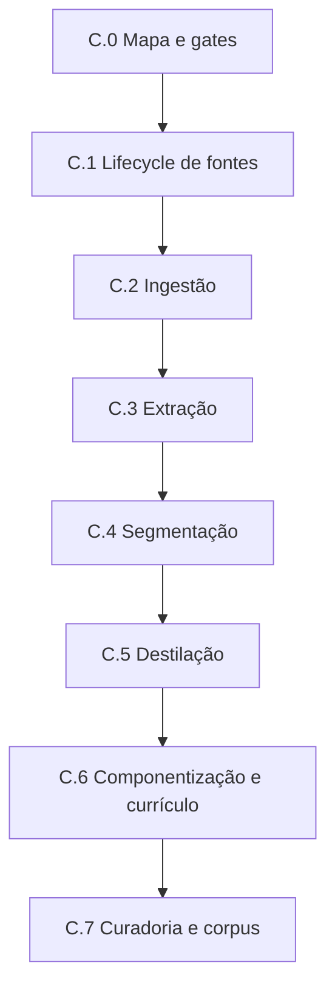

# Fase C — Mapa integral de execução da matéria-prima

Data da definição: 11 de agosto de 2026.

Base canônica: `main` em `73599716f28073eb93894682736e4bd497103a49`.

Detalhamento complementar: [`PHASE-C-KNOWLEDGE-CARTOGRAPHY-ACTION-PLAN.md`](PHASE-C-KNOWLEDGE-CARTOGRAPHY-ACTION-PLAN.md).

## Status

**C.0 concluído documentalmente e pronto para publicação. Este mapa torna visível toda a Fase C,
mas não autoriza código, ingestão, processamento de fontes reais, migrations, wiring, Supabase
hospedado ou produção.**

Somente o sublote `C.0` — definição, navegação e gates — está abrangido pela autorização que
originou este documento. Cada lote e sublote técnico posterior exige definição específica,
Definition of Ready satisfeita e autorização humana própria.

## 1. Objetivo

Transformar fontes autorizadas em componentes pedagógicos semielaborados, autorais, versionados,
rastreáveis, vinculados ao currículo e aprovados por curadoria, formando o corpus piloto que
alimentará os experimentos de retrieval da Fase D.

O produto da Fase C não é um plano de aula, uma avaliação ou outro material final. É matéria-prima
pedagógica preparada para que os agentes produzam posteriormente com qualidade e baixo consumo de
contexto.

O processamento de obras deverá preservar árvore editorial, manifesto integral de cobertura, notas
atômicas, relações tipadas e vínculos curriculares com estados de evidência distintos. As ações,
artefatos e gates complementares estão definidos no plano de cartografia e formação do grafo de
conhecimento, sem autorização implícita de implementação.

## 2. Hierarquia oficial

```text
FASE C — MATÉRIA-PRIMA
├── C.0 — Definição integral, governança e gates
├── C.1 — Governança operacional do lifecycle de fontes
├── C.2 — Ingestão controlada
├── C.3 — Extração e validação do conteúdo extraído
├── C.4 — Segmentação e classificação estrutural
├── C.5 — Destilação pedagógica e deduplicação
├── C.6 — Componentização, versionamento e vínculo curricular
└── C.7 — Curadoria, publicação no corpus piloto e gate C → D
```

Cada lote segue a mesma decomposição:

```text
Fase → Lote → Sublote → Epic → Feature → User Story → tarefa técnica → teste → gate → checkpoint
```

Epics, Features e Stories preservam os identificadores aprovados no Marco 003. Este documento os
materializa no contexto da Fase C; não cria uma segunda taxonomia concorrente.

## 3. Estado executivo

| Lote | Capacidade | Epics/Stories principais | Estado | Gate de início |
|---|---|---|---|---|
| C.0 | Mapa integral e governança | EPIC-001 | Pronto para integração | autorização recebida |
| C.1 | Lifecycle, procedência, licença e permissão | EPIC-002; US-002.1–002.2 | Bloqueado | C.0 integrado e autorização própria |
| C.2 | Entrada controlada de fonte autorizada | EPIC-003; US-003.1 | Bloqueado | C.1 concluído; `GAP-3B-04` encerrado |
| C.3 | Extração rastreável e validação | EPIC-003; US-003.1 | Bloqueado | C.2 concluído |
| C.4 | Segmentos estruturais e classificação | EPIC-003; US-003.2 | Bloqueado | C.3 concluído |
| C.5 | Síntese autoral e deduplicação | EPIC-005; US-005.1–005.2 | Bloqueado | C.4 concluído |
| C.6 | Componentes canônicos e currículo | EPIC-004/006; US-004.1–004.3 e US-006.1–006.2 | Bloqueado | C.5 concluído e pacote curricular aprovado |
| C.7 | Curadoria e corpus piloto | EPIC-004/005/006 | Bloqueado | C.6 concluído |

`Bloqueado` significa não autorizado para execução. Não significa descartado.

## 4. Lote C.0 — Definição integral, governança e gates

### Objetivo

Tornar visível o percurso completo antes do primeiro código da fase e impedir que uma etapa futura
seja iniciada por continuidade implícita.

### Sublotes

- `C.0.1` — consolidar a hierarquia Fase/Lote/Sublote/Epic/Feature/Story;
- `C.0.2` — mapear dependências, entradas, saídas e bloqueios;
- `C.0.3` — definir gates humanos e checkpoints obrigatórios;
- `C.0.4` — atualizar Blueprint, README, Decision Log e navegação oficial.

### Entregas

- este mapa integral;
- atualização do Blueprint;
- ADR de decomposição e controle de escopo;
- Checkpoint 033;
- identificação inequívoca de `C.1` como primeiro lote técnico candidato.

### Gate de saída

- todos os lotes C.1–C.7 visíveis;
- Stories canônicas mapeadas;
- dependências e proibições explícitas;
- nenhuma alteração não documental;
- integração humana do PR documental;
- nova autorização específica antes de definir ou implementar C.1.

## 5. Lote C.1 — Governança operacional do lifecycle de fontes

### Objetivo

Resolver a fronteira que o adapter do Lote 3B.2 deliberadamente não antecipou: registrar e controlar
versões, permissões, bloqueios, revogações e transições de uma fonte antes da ingestão.

### Epic, Features e Stories

- `EPIC-002` — Governança das fontes e direitos de uso;
- `F-002.1` / `US-002.1` — registro de fonte e procedência;
- `F-002.2` / `US-002.2` — autorização ou bloqueio de uso na geração.

As Stories foram parcialmente atendidas nas Fases A e B quanto a contratos, política de
elegibilidade, schema base e adapter mínimo. A operação completa do lifecycle continua pendente.

### Sublotes candidatos

- `C.1.1` — contrato normativo de estados, comandos, eventos e invariantes;
- `C.1.2` — modelo físico incremental, RLS, grants e rollback;
- `C.1.3` — RPCs ou outra fronteira atômica para versão e permissão;
- `C.1.4` — adapters de comando/leitura e tradução provider-neutral;
- `C.1.5` — testes unitários, integração descartável, idempotência e concorrência;
- `C.1.6` — fechamento documental do lote e decisão sobre `GAP-3B-04`.

### Regras mínimas

- nenhuma fonte avança sem procedência e identidade verificáveis;
- checksum não substitui identidade bibliográfica ou jurídica;
- permissão é histórica e revogável, nunca um booleano sobrescrito silenciosamente;
- versão da obra, versão do arquivo e versão do processamento são conceitos distintos;
- uma revogação impede novos usos sem apagar auditoria ou produtos históricos;
- PNLD real permanece proibido sem decisão jurídica e autorização específicas;
- falha parcial não pode deixar versão publicada sem seu evento de permissão correspondente.

### Gate de saída

`GAP-3B-04` somente poderá ser encerrado quando o lifecycle necessário à ingestão estiver definido,
persistido, protegido, adaptado e testado. O fechamento não autoriza automaticamente C.2.

## 6. Lote C.2 — Ingestão controlada

### Objetivo

Receber uma fonte autorizada em área de preparação, verificar identidade e integridade e abrir uma
execução de ingestão rastreável, sem publicar conteúdo parcial.

### Epic, Feature e Story

- `EPIC-003` — Ingestão e leitura estrutural das fontes;
- `F-003.1` / `US-003.1` — ingestão assistida do conjunto piloto.

### Sublotes candidatos

- `C.2.1` — contrato de solicitação, recibo e estado da ingestão;
- `C.2.2` — intake/staging seguro e limites de tamanho/formato;
- `C.2.3` — verificação de checksum, duplicidade e vínculo com fonte/versão;
- `C.2.4` — idempotência, retomada controlada e registro de falhas;
- `C.2.5` — revisão humana antes da extração;
- `C.2.6` — checkpoint e gate para C.3.

### Gate de saída

- somente fontes autorizadas são aceitas;
- cada execução possui identidade, versão e estado auditável;
- duplicidade e replay têm comportamento definido;
- falha não produz publicação parcial;
- nenhum conteúdo real entra sem corpus e base jurídica explicitamente aprovados.
- PDF, páginas renderizadas, recortes e miniaturas permanecem somente em staging temporário, com
  prazo e descarte verificável; nunca integram o corpus permanente.

## 7. Lote C.3 — Extração e validação do conteúdo extraído

### Objetivo

Extrair prioritariamente a camada textual e a estrutura observável dos PDFs editoriais sem tratar o
resultado do parser — ou de eventual OCR de exceção — como conhecimento pedagógico validado.

### Epic, Feature e Story

- `EPIC-003`;
- `F-003.1` / `US-003.1`, na parcela de extração textual vinculada à fonte e à versão.

### Sublotes candidatos

- `C.3.1` — porta de extrator e contrato de resultado provider-neutral;
- `C.3.2` — extração nativa da camada textual do formato piloto aprovado;
- `C.3.3` — preservação de páginas, capítulos, seções e ordem quando observáveis;
- `C.3.4` — métricas de qualidade, páginas vazias e caracteres inválidos;
- `C.3.5` — revisão humana, rejeição e reprocessamento controlado;
- `C.3.6` — checkpoint e gate para C.4.

### Gate de saída

- conteúdo extraído sempre aponta para fonte, versão e execução;
- extração nativa é o caminho padrão para PDFs com camada textual utilizável;
- OCR é fallback por página ou elemento, somente diante de ausência, corrupção ou insuficiência
  comprovada da camada textual, com motivo e cobertura registrados;
- qualidade mínima e exceções estão mensuradas;
- erro ou baixa confiança não avança silenciosamente;
- OCR industrial, multimodalidade completa e processamento massivo continuam fora do piloto.
- imagens, mapas e infográficos são persistidos como descrições semânticas; tabelas e gráficos
  quantitativos, como dados estruturados e descrições;
- saídas brutas, PDFs, renderizações, recortes e coordenadas em pixels são descartados após a
  validação, com recibo auditável.

## 8. Lote C.4 — Segmentação e classificação estrutural

### Objetivo

Transformar a extração aprovada em segmentos navegáveis, preservando contexto e ordem para
destilação e auditoria, sem publicar chunks crus para consumo final dos agentes.

### Epic, Feature e Story

- `EPIC-003`;
- `F-003.2` / `US-003.2` — segmentação e classificação estrutural.

### Sublotes candidatos

- `C.4.1` — contrato de segmento, localização, hierarquia e confiança;
- `C.4.2` — regras de fronteira por capítulo, seção, bloco e página;
- `C.4.3` — classificação mínima: conceito, explicação, exemplo, atividade, questão e orientação;
- `C.4.4` — reconstrução de ordem e integridade referencial;
- `C.4.5` — revisão de segmentos incompletos ou ambíguos;
- `C.4.6` — checkpoint e gate para C.5.

### Gate de saída

- origem e posição lógica de cada segmento são localizáveis por obra, edição, página, região,
  seção e bloco, sem conservar cópia visual permanente da fonte;
- classificação possui confiança e estado de revisão;
- segmentos não se confundem com componentes pedagógicos;
- nenhum chunk cru é publicado como resposta ou produto.

## 9. Lote C.5 — Destilação pedagógica e deduplicação

### Objetivo

Converter contribuições rastreáveis em sínteses pedagógicas próprias, distinguindo fatos,
interpretações, problemas, estratégias e divergências sem reproduzir extensamente uma obra.

### Epic, Features e Stories

- `EPIC-005` — Destilação, consolidação e deduplicação;
- `F-005.1` / `US-005.1` — destilação autoral rastreável;
- `F-005.2` / `US-005.2` — consolidação e duplicidade básica.

### Sublotes candidatos

- `C.5.1` — contrato de contribuição, síntese, evidência e divergência;
- `C.5.2` — processo assistido de destilação multifonte;
- `C.5.3` — verificação autoral inicial e bloqueio de cópia extensa;
- `C.5.4` — detecção de candidatos duplicados ou relacionados;
- `C.5.5` — decisão humana: unir, relacionar, manter ou rejeitar;
- `C.5.6` — checkpoint e gate para C.6.

### Gate de saída

- cada síntese conserva evidências de origem;
- fonte não autorizada não participa da destilação gerativa;
- divergências relevantes não são apagadas por consolidação;
- decisão de deduplicação é auditável;
- revisão humana é obrigatória no corpus piloto.

## 10. Lote C.6 — Componentização, versionamento e vínculo curricular

### Objetivo

Materializar sínteses aprovadas como componentes pedagógicos canônicos, tipados, versionados e
vinculados ao pacote curricular aplicável.

### Epics, Features e Stories

- `EPIC-004` — Componentes pedagógicos semielaborados;
- `F-004.1` / `US-004.1` — componente canônico;
- `F-004.2` / `US-004.2` — tipologia mínima;
- `F-004.3` / `US-004.3` — revisão e versionamento;
- `EPIC-006` — Pacotes curriculares plugáveis;
- `F-006.1` / `US-006.1` — pacote curricular MG do piloto;
- `F-006.2` / `US-006.2` — vínculo componente–currículo.

Contratos, persistência e adapters de componentes/currículo já possuem fundações das Fases A e B.
Isso reduz risco, mas não conclui as Stories operacionais nem autoriza conteúdo real.

### Sublotes candidatos

- `C.6.1` — confirmar tipologia e campos obrigatórios do piloto;
- `C.6.2` — transformar síntese aprovada em versão de componente;
- `C.6.3` — validar procedência, licença e evidências completas;
- `C.6.4` — vincular ao pacote e aos nós curriculares aprovados;
- `C.6.5` — persistência transacional pelas RPCs já aprovadas, sem DML paralelo;
- `C.6.6` — testes de elegibilidade, versão, rollback e rastreabilidade;
- `C.6.7` — checkpoint e gate para C.7.

### Gate de saída

- componentes não são produtos finais;
- somente versão completa pode entrar em revisão;
- vínculo curricular tem justificativa e estado próprio;
- nenhuma escrita contorna as RPCs transacionais da Fase B;
- pacote RS e mistura de Estados permanecem bloqueados.

## 11. Lote C.7 — Curadoria, publicação no corpus piloto e gate C → D

### Objetivo

Aplicar revisão pedagógica, curricular, jurídica e autoral antes de tornar componentes elegíveis ao
corpus piloto usado nos experimentos da Fase D.

### Escopo de Stories

Consolidar a conclusão operacional das Stories `US-004.1–004.3`, `US-005.1–005.2` e
`US-006.1–006.2`, sem declarar concluídas Stories de retrieval, agentes, geração ou entrega.

### Sublotes candidatos

- `C.7.1` — fila de curadoria, papéis e segregação de responsabilidades;
- `C.7.2` — rubrica pedagógica, curricular, jurídica e autoral;
- `C.7.3` — aprovação, rejeição, suspensão e substituição auditáveis;
- `C.7.4` — análise de cobertura por tema, tipo e nó curricular;
- `C.7.5` — corpus piloto alinhado à meta de 100–300 componentes revisados;
- `C.7.6` — amostra e manifesto imutável para experimentos de retrieval;
- `C.7.7` — inspeção do gate C → D e checkpoint de encerramento.

### Gate de saída da Fase C

- corpus piloto curado e versionado;
- procedência, versões e permissões confiáveis;
- tipologia suficientemente estável;
- vínculos curriculares revisados;
- amostra adequada aos experimentos de retrieval;
- componentes suspensos, rejeitados ou substituídos excluídos do conjunto elegível;
- métricas de cobertura e lacunas conhecidas;
- nenhum conteúdo protegido exposto indevidamente;
- `GAP-3B-04` encerrado ou novo bloqueio formal aprovado;
- `GAP-3B-05` e `GAP-3B-07` não declarados resolvidos sem seus próprios critérios;
- autorização humana específica para iniciar a Fase D.

## 12. Dependências



Paralelismo somente poderá ser aprovado quando não romper precedência de dados, direitos de uso,
rastreabilidade ou gate humano. A visibilidade de uma etapa não é autorização para antecipá-la.

## 13. Relação com os GAPs herdados

### GAP-3B-04 — Lifecycle de fontes

- destino primário: `C.1`;
- permanece ativo durante C.0;
- bloqueia ingestão real;
- somente encerra com contrato, persistência, segurança, adapter e testes integrados.

### GAP-3B-05 — Auditoria enriquecida / US-013.2 parcial

- permanece ativo e contido;
- a Fase C registra apenas a auditoria suportada pelos contratos atuais;
- qualquer extensão exige contrato explícito, minimização/LGPD, persistência e testes de round-trip;
- não pode ser resolvido incidentalmente dentro de um lote de ingestão.

### GAP-3B-07 — OPP normativa incompleta

- permanece ativo e contido para as fases de retrieval, agentes, validação e entrega;
- a Fase C não deve transformar a OPP do professor em job interno de ingestão sem decisão própria;
- não pode ser declarado resolvido pelo corpus piloto.

## 14. Matriz de fronteiras

| Capacidade | Fase C | Fase posterior |
|---|---|---|
| Governar fontes e permissões | Incluída | gestão jurídica ampliada |
| Ingestão assistida do piloto | Incluída | ingestão massiva/OCR industrial |
| Extração e segmentação | Incluída | multimodalidade completa |
| Destilação e deduplicação básica | Incluída | consolidação automática avançada |
| Componentes e currículo MG | Incluída | RS e outros Estados |
| Curadoria humana do piloto | Incluída | publicação automatizada em escala |
| Embeddings e retrieval | Proibidos | Fase D |
| Runtime de agentes | Proibido | Fase E |
| Produto pedagógico final | Proibido | Fases E–F |
| Wiring e produção | Proibidos | trilha separada com gate próprio |

## 15. Gate obrigatório de cada sublote

Nenhum sublote avança apenas porque o anterior foi concluído. Cada um exige:

1. definição documental específica;
2. Stories, critérios de aceite e não escopo identificados;
3. contratos e fronteiras revisados;
4. análise jurídica/LGPD quando aplicável;
5. plano de testes e rollback;
6. autorização humana antes da implementação;
7. CI, typecheck e testes aplicáveis verdes;
8. Supabase somente descartável quando banco estiver no escopo;
9. revisão do diff e merge humano;
10. checkpoint pós-merge antes do próximo sublote.

## 16. Itens proibidos por esta definição

- código ou dependências;
- migrations, RPCs, RLS ou grants;
- upload ou ingestão de arquivo real;
- PNLD real ou conteúdo protegido;
- currículo real adicional;
- embeddings, pgvector, busca híbrida ou reranking;
- OpenAI, modelos, prompts ou agentes executáveis;
- ativação do Sócrates 2;
- OPP normativa ampliada;
- frontend, API, job ou fila;
- Supabase hospedado, `service_role`, wiring ou produção;
- Nexus, Gráfica, PDF ou PPTX;
- início implícito de C.1–C.7.

## 17. Próximo escopo elegível

Depois da integração humana deste mapa e do Checkpoint 033, o próximo trabalho elegível será
exclusivamente a **definição documental do Lote C.1 — Governança operacional do lifecycle de
fontes**.

Essa definição deverá detalhar estados, transições, comandos, eventos, idempotência, concorrência,
segurança, migrations, adapters, testes e condição exata de encerramento de `GAP-3B-04`. Ela não
deverá iniciar ingestão nem processar conteúdo real.
