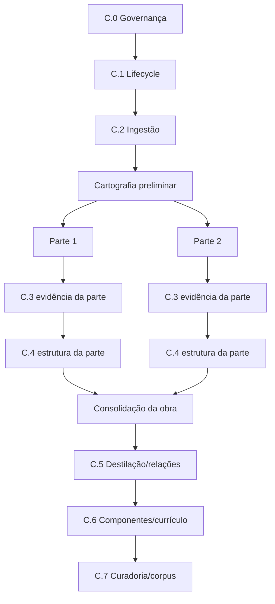

# Fase C — Mapa integral de execução da matéria-prima

Data da definição inicial: 11 de agosto de 2026.

Reconciliação executiva: 18 de agosto de 2026.

Base canônica da reconciliação: `main@c7cea4b7d0e4c12182a28fa85a4a2ad8f57b282e`.

Documentos complementares:

- [`PHASE-C-KNOWLEDGE-CARTOGRAPHY-ACTION-PLAN.md`](PHASE-C-KNOWLEDGE-CARTOGRAPHY-ACTION-PLAN.md);
- [`PHASE-C-VERTICAL-CARTOGRAPHY-RECONCILIATION.md`](PHASE-C-VERTICAL-CARTOGRAPHY-RECONCILIATION.md);
- [`LOT-C3-EXTRACTION-AND-VALIDATION-DEFINITION.md`](LOT-C3-EXTRACTION-AND-VALIDATION-DEFINITION.md).

## 1. Objetivo

Transformar fontes autorizadas em componentes pedagógicos semielaborados, autorais, versionados, rastreáveis, conectados e curados, formando o corpus piloto que alimentará os experimentos de retrieval da Fase D.

A Fase C não produz plano de aula, avaliação ou outro produto final. Ela constrói o **almoxarifado de conhecimento** que permitirá produção posterior com baixo consumo de contexto e alta rastreabilidade.

A Fase C deve conservar simultaneamente:

```text
ÁRVORE EDITORIAL
MANIFESTO DE COBERTURA
GRAFO DE CONHECIMENTO
GRAFO PEDAGÓGICO-CURRICULAR
```

## 2. Hierarquia oficial de responsabilidades

```text
FASE C — MATÉRIA-PRIMA E CONSTRUÇÃO DO CONHECIMENTO
├── C.0 — definição integral, governança e gates
├── C.1 — lifecycle de fontes, procedência e direitos
├── C.2 — ingestão controlada
├── C.3 — extração e validação observável
├── C.4 — reconstrução e classificação estrutural
├── C.5 — destilação, relações e deduplicação
├── C.6 — componentização, versionamento e vínculo curricular
└── C.7 — curadoria, corpus piloto e gate C → D
```

Essa hierarquia define **autoridade sobre os dados**, não obriga uma obra inteira a terminar um lote horizontalmente antes de qualquer responsabilidade posterior poder operar sobre uma parte elegível.

## 3. Princípio executivo reconciliado

> **A obra é cartografada primeiro e aprofundada por partes.**

A sequência monolítica:

```text
livro inteiro em C.3
  -> livro inteiro em C.4
  -> livro inteiro em C.5
```

não é mais a interpretação operacional da Fase C.

O processamento deverá seguir:

```text
PASSAGEM 1 — CARTOGRAFIA PRELIMINAR
arquivo -> identidade -> preliminares -> sumário/organização -> árvore candidata -> plano de partes

PASSAGEM 2 — CICLO VERTICAL
parte -> C.3 observável -> C.4 estrutural -> reconciliação/revisão -> próxima parte

PASSAGEM 3 — CONSOLIDAÇÃO
partes reconciliadas -> relações globais -> C.5 -> C.6 -> C.7
```

C.5–C.7 continuam bloqueados até contratos/gates próprios. O modelo vertical não autoriza antecipação técnica; ele elimina apenas a barreira artificial de “livro inteiro concluído”.

## 4. Estado executivo atual

| Lote/capacidade | Estado em 18/08/2026 | Próxima condição |
|---|---|---|
| C.0 | concluído | — |
| C.1 | concluído — C.1.1–C.1.6 | — |
| C.2 | concluído — C.2.1–C.2.6 | — |
| C.3.1 | concluído/integrado | preservar |
| C.3.2 | concluído/integrado | preservar |
| C.3.3 | concluído/integrado | usar na prova vertical |
| C.3.4 | concluído/integrado | usar na prova vertical |
| C.3.5 | concluído/integrado | usar na prova vertical |
| C.3.6 | PR #110 aberto, não integrado, suspenso | reavaliar após prova vertical |
| reconhecimento estrutural | próximo caminho principal | definir protocolo mínimo |
| golden sample | pendente | criar fixture sintética rica |
| prova vertical `Introdução` | pendente | executar após protocolo/golden sample |
| C.3.7 | não iniciar | necessidade multimodal/OCR demonstrada |
| C.3.8 | não iniciar no formato anterior | reconciliar após prova vertical |
| C.4 técnico | ainda não iniciado | contrato orientado por árvore candidata/parte |
| C.5 | bloqueado | saída estrutural elegível |
| C.6 | bloqueado | destilação/relações aprovadas |
| C.7 | bloqueado | componentes e vínculos aprovados |

## 5. C.0 — definição e governança

C.0 permanece encerrado. Sua função foi tornar o percurso visível antes do código e impedir continuidade implícita.

A reconciliação de 18/08/2026 não reabre C.0. Ela corrige a leitura operacional da Fase C a partir de evidência prática obtida ao analisar a estrutura de uma obra didática real fora do corpus.

## 6. C.1 — lifecycle de fontes

C.1 permanece concluído.

Regras preservadas:

- obra, edição, manifestação, arquivo, versão do arquivo e execução são identidades distintas;
- permissão é histórica, temporal, escopada e revogável;
- autorização técnica não substitui autorização de negócio;
- livro do estudante, Manual do Professor, suplementos e materiais digitais podem exigir identidade/trilha própria;
- PNLD real ou outra fonte protegida exige fronteira jurídica específica;
- retenção e impacto de revogação permanecem auditáveis.

`GAP-3B-04` permanece encerrado.

## 7. C.2 — ingestão controlada

C.2 permanece concluído e termina no handoff `APPROVED_FOR_EXTRACTION`.

Ele continua responsável por:

- staging temporário;
- integridade/checksum;
- vínculo com fonte/versão;
- duplicidade;
- idempotência e fail-safe;
- revisão humana anterior à extração;
- autorização independente para `purpose=extraction`;
- handoff read-only;
- descarte verificável nos caminhos aplicáveis.

C.2 **não** localiza sumário, não interpreta páginas e não constrói árvore editorial.

## 8. Cartografia preliminar — responsabilidade transversal de coordenação

Antes do aprofundamento semântico, a coordenação cartográfica deverá produzir uma árvore candidata utilizando somente observações rastreáveis.

### Entradas preferenciais

- `filename_hints`;
- capa/folha de rosto;
- ficha catalográfica;
- apresentação;
- organização da obra;
- sumário/índice;
- marcadores internos;
- paratextos curriculares;
- paginação física e impressa;
- títulos efetivamente observados nas páginas necessárias para confirmar fronteiras iniciais.

### Saída

```text
mapa editorial preliminar
+ inventário de regiões
+ correspondência inicial pdf_page x printed_page
+ plano de partes
+ confiança/origem de cada hipótese
```

Essa saída **não é a árvore canônica de C.4**. É uma hipótese operacional que orienta quais páginas e partes C.3 deve processar e em que ordem.

## 9. C.3 — extração e validação observável

### Autoridade

C.3 responde:

> o que foi observado e extraído, de onde, com qual método, cobertura, autorização e decisão de qualidade?

Pode produzir:

- páginas físicas;
- paginação impressa quando observada;
- texto nativo;
- blocos/elementos físicos observados;
- relações tabulares físicas quando disponíveis;
- marcadores de elementos visuais;
- proveniência e método;
- métricas;
- cobertura física;
- revisão humana de extração.

Não produz como verdade canônica:

- conceito pedagógico;
- segmento semântico;
- hierarquia editorial confirmada;
- alinhamento BNCC validado;
- componente pedagógico;
- embedding/retrieval.

### Uso orientado por partes

C.3 deve poder executar sobre uma parte delimitada pelo plano cartográfico, preservando ancestralidade da obra e cobertura global.

Uma parte concluída pode produzir evidência elegível para reconstrução estrutural daquela parte quando o contrato de C.4 assim permitir, sem exigir que todas as demais páginas da obra já tenham atravessado C.3.

## 10. C.3.6 — hardening suspenso

O PR #110 contém proposta de recovery, concorrência, cancelamento e cleanup e permanece aberto/não integrado.

Classificação atual:

> infraestrutura de confiabilidade potencialmente útil, mas não determinante do caminho principal.

As duas provas verticais foram concluídas sem exigir essa superfície. O PR permanece suspenso e não
deve ser corrigido, rebaseado ou integrado automaticamente.

A decisão será tomada com base nas falhas concretas do primeiro piloto controlado:

1. integrar apenas a infraestrutura genérica realmente necessária;
2. ajustar retry/lease/cleanup à identidade da parte;
3. simplificar, substituir ou adiar superfícies não exercitadas.

## 11. C.3.7 — multimodal e fallback visual

C.3.7 deixa de ser interpretado como “a etapa de OCR”.

A futura capacidade deverá avaliar:

```text
texto nativo
  -> caminho normal

compreensão multimodal
  -> quando visual/layout carrega informação pedagógica

OCR localizado
  -> texto relevante ausente/corrompido na camada nativa
```

Nenhum provedor ou modelo é pressuposto.

## 12. C.4 — reconstrução e classificação estrutural

### Autoridade

C.4 confirma ou corrige a estrutura candidata com base na evidência extraída.

Responsabilidades:

- confirmar parte/unidade/capítulo/seção/subseção;
- segmentar por fronteira editorial;
- preservar continuidade quando houver fragmentação técnica;
- classificar regiões/blocos por função;
- distinguir exposição, atividade, orientação docente, referência, paratexto etc.;
- identificar notas/contribuições candidatas;
- reconciliar sumário, corpo e regiões descobertas.

### Gate por parte

O gate não é mais “C.3 de toda a obra concluído”.

Uma parte pode entrar na reconstrução quando:

- possui ancestralidade cartográfica candidata;
- possui evidência C.3 suficiente para sua fronteira;
- sua cobertura física local está reconciliada ou pendências estão explicitadas;
- autorização permanece válida;
- o contrato C.4 correspondente estiver aprovado.

O fechamento **da obra** continua exigindo reconciliação de todas as partes esperadas.

## 13. C.5 — destilação e relações

C.5 permanece posterior à reconstrução estrutural elegível.

Deverá:

- produzir contribuições autorais rastreáveis;
- distinguir consenso, complementaridade e divergência;
- propor relações tipadas com evidência;
- deduplicar sem apagar controvérsia;
- impedir que uma única coleção se torne ontologia canônica;
- submeter decisões relevantes à curadoria humana no piloto.

## 14. C.6 — componentização e currículo

C.6 promove apenas resultados aprovados.

Estados de evidência curricular devem permanecer distintos, preservando no mínimo a semântica de:

```text
DECLARADO_PELA_OBRA
DETECTADO_NO_CONTEUDO
PROPOSTO_PELO_PROCESSAMENTO
VALIDADO_NORMATIVAMENTE
APROVADO_PELO_CURADOR
REJEITADO/SUSPENSO
```

Declaração editorial explícita é evidência forte do que a obra declara, mas não prova validação normativa independente.

## 15. C.7 — curadoria e fechamento da Fase C

Hierarquia de consolidação:

```text
bloco/elemento
  -> página
  -> parte operacional
  -> seção
  -> capítulo
  -> unidade
  -> obra
  -> corpus piloto
```

C.7 somente fecha a obra quando nenhuma parte esperada permanece sem decisão.

Gate C → D exige:

- corpus piloto curado/versionado;
- procedência e permissões confiáveis;
- componentes e relações revisados;
- vínculos curriculares em estado explícito;
- lacunas conhecidas;
- amostra reproduzível;
- autorização humana para experimentos de retrieval.

## 16. Golden sample e cartografia integrados

O golden sample estrutural sintético e a cartografia preliminar foram integrados pelo PR nº 113. A
prova localiza organização da obra, sumário, dupla paginação, regiões e limites de partes sem leitura
profunda do artefato inteiro.

## 17. Duas provas verticais integradas

### Introdução — PR nº 114

A primeira prova processa somente páginas físicas 11–13 e consulta a região do Manual somente para
uma orientação docente explicitamente ancorada. Ela preserva títulos, texto, marcador visual,
legenda, atividade e orientação como candidatos rastreáveis.

### Unidade 1 — PR nº 116

A segunda prova processa somente páginas físicas 14–17 e preserva `unit → chapter`. O
`chapter_heading` continua ativo através de páginas, e a ausência de atividade reconhecida impede
consulta desnecessária ao Manual.

### Resultado

O mecanismo apresentou **pequena generalização**, não acoplamento à Introdução:

- tipos estruturais vêm da cartografia;
- contexto permanece local ao `CartographicPartScope`;
- texto sem evidência adicional continua `body_text`;
- regiões auxiliares são consultadas somente por âncora;
- nenhuma heurística, fixture nova ou grande ontologia foi necessária.

Uma terceira prova sintética exige risco estrutural novo. O próximo passo material é um piloto
controlado de uma única parte real autorizada.

## 18. Dependências reconciliadas



A representação ilustra fluxo de dados. Não autoriza tecnicamente C.4–C.7 antes de seus contratos.

## 19. Matriz de fronteiras

| Capacidade | Autoridade principal | Observação |
|---|---|---|
| identidade e permissão | C.1 | histórica e temporal |
| staging/integridade | C.2 | sem semântica |
| cartografia preliminar | coordenação transversal | hipótese rastreável |
| texto/página/elemento observado | C.3 | evidência física |
| hierarquia confirmada/segmento | C.4 | semântica estrutural |
| contribuição/relação/deduplicação | C.5 | autoral e multifonte |
| componente/vínculo curricular | C.6 | versionado e validável |
| elegibilidade do corpus | C.7 | curadoria |
| embeddings/retrieval | Fase D | índice, não verdade |
| runtime agêntico | Fase E | produção |

## 20. Riscos principais

| Risco | Controle |
|---|---|
| processar livro inteiro sem mapa | cartografia obrigatória |
| tratar sumário como verdade | reconciliar com corpo |
| confundir PDF page e printed page | dupla paginação explícita |
| perder boxes/atividades/Manual | inventário de regiões e gramática editorial |
| achatar visual em texto sem função | tratamento multimodal dirigido |
| usar OCR em tudo | OCR somente fallback localizado |
| excesso de hardening antes do happy path | prova vertical antes de novas exceções |
| copiar sequência de coleção | grafo independente e destilação multifonte |
| confundir BNCC declarada e validada | estados de evidência distintos |
| vetorizar tudo | embeddings seletivos na Fase D |

## 21. Governança proporcional

Cada nova fronteira material ainda exige definição e aprovação, mas não há necessidade de nova microautorização para cada commit/teste/correção dentro de escopo aprovado.

Checkpoint deve existir quando agrega continuidade real: mudança de fronteira, incidente, handoff ou fechamento relevante.

Conteúdo real protegido, novo provider relevante, produção, secrets e dados sensíveis continuam sujeitos aos níveis de governança correspondentes.

## 22. Próximo escopo elegível

Ordem executiva atual:

```text
1. integrar a consolidação documental e o Checkpoint 051;
2. delimitar juridicamente uma obra/parte para piloto controlado;
3. definir ambiente temporário, retenção, descarte e revisão;
4. cartografar a obra e aprofundar somente a parte autorizada;
5. comparar a reconstrução com a estrutura editorial real;
6. decidir C.3.6 / PR #110 a partir de falhas concretas;
7. decidir multimodal/OCR apenas diante de necessidade localizada;
8. abrir C.4 integral somente depois dessa evidência.
```

Não iniciar obra inteira, corpus, produção, embeddings, retrieval, OCR geral ou runtime multiagente
por continuidade implícita.
