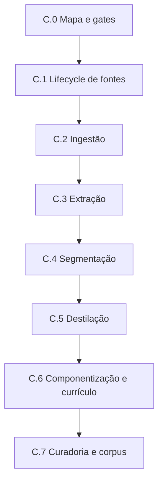

# Fase C — Mapa integral de execução da matéria-prima

Data da definição: 11 de agosto de 2026.

Base original da definição de C.0: `main` em `73599716f28073eb93894682736e4bd497103a49`.

Estado técnico canônico após a integração de C.2.6 verificado em 15 de agosto de 2026: `main` em
`3b8c2d317542bd701ea61e671f9b6e4334f61b1c` (PR nº 93), tree
`0fbe3377d3dac6aa9730a6e895d20a0762fc855c`, parent
`57d7e387676224ef6fb5e3101270c0b6e4f8c245`.

Detalhamento complementar: [`PHASE-C-KNOWLEDGE-CARTOGRAPHY-ACTION-PLAN.md`](PHASE-C-KNOWLEDGE-CARTOGRAPHY-ACTION-PLAN.md).

Definição específica de C.1:
[`LOT-C1-SOURCE-LIFECYCLE-GOVERNANCE-DEFINITION.md`](LOT-C1-SOURCE-LIFECYCLE-GOVERNANCE-DEFINITION.md).

Auditoria de fechamento de C.1:
[`LOT-C1-6-SOURCE-LIFECYCLE-CLOSURE-MATRIX.md`](LOT-C1-6-SOURCE-LIFECYCLE-CLOSURE-MATRIX.md).

Definição específica de C.2:
[`LOT-C2-CONTROLLED-INGESTION-DEFINITION.md`](LOT-C2-CONTROLLED-INGESTION-DEFINITION.md).

Definição integrada de C.2.1:
[`LOT-C2-1-INGESTION-CONTRACTS-AND-STATE-MACHINE.md`](LOT-C2-1-INGESTION-CONTRACTS-AND-STATE-MACHINE.md).

Definição integrada de C.2.2:
[`LOT-C2-2-SECURE-STAGING-LIMITS-AND-RETENTION.md`](LOT-C2-2-SECURE-STAGING-LIMITS-AND-RETENTION.md).

Definição integrada de C.2.3:
[`LOT-C2-3-INTEGRITY-CHECKSUM-DUPLICITY-AND-LINKAGE.md`](LOT-C2-3-INTEGRITY-CHECKSUM-DUPLICITY-AND-LINKAGE.md).

Definição integrada de C.2.4:
[`LOT-C2-4-IDEMPOTENCY-RECOVERY-AND-FAIL-SAFE.md`](LOT-C2-4-IDEMPOTENCY-RECOVERY-AND-FAIL-SAFE.md).

Definição integrada de C.2.5:
[`LOT-C2-5-HUMAN-REVIEW-AND-C3-HANDOFF.md`](LOT-C2-5-HUMAN-REVIEW-AND-C3-HANDOFF.md).

Prova integrada e fechamento de C.2.6:
[`LOT-C2-6-INTEGRATED-PROOF-AND-CLOSURE.md`](LOT-C2-6-INTEGRATED-PROOF-AND-CLOSURE.md).

## Status

**C.0 está integrado. C.1 foi concluído integralmente de C.1.1 a C.1.6 e `GAP-3B-04` está
encerrado. C.2 foi concluído integralmente de C.2.1 a C.2.6 após o PR nº 93, com CI pós-merge nº 562
verde e fechamento documental no Checkpoint 050. C.3–C.7, ingestão real, fontes reais, wiring,
Supabase hospedado, Storage hospedado e produção permanecem bloqueados.**

A visibilidade de C.3–C.7 permanece planejamento, não autorização automática. Cada implementação de
lote ou sublote exige Definition of Ready satisfeita e autorização humana própria.

## 1. Objetivo

Transformar fontes autorizadas em componentes pedagógicos semielaborados, autorais, versionados,
rastreáveis, vinculados ao currículo e aprovados por curadoria, formando o corpus piloto que
alimentará os experimentos de retrieval da Fase D.

O produto da Fase C não é um plano de aula, uma avaliação ou outro material final. É matéria-prima
pedagógica preparada para que os agentes produzam posteriormente com qualidade e baixo consumo de
contexto.

O processamento de obras deverá preservar árvore editorial, manifesto integral de cobertura, notas
atômicas, relações tipadas e vínculos curriculares com estados de evidência distintos. As ações,
artefatos e gates complementares estão definidos no plano de cartografia e formação do grafo de
conhecimento, sem autorização implícita de implementação.

## 2. Hierarquia oficial

```text
FASE C — MATÉRIA-PRIMA
├── C.0 — Definição integral, governança e gates
├── C.1 — Governança operacional do lifecycle de fontes
├── C.2 — Ingestão controlada
├── C.3 — Extração e validação do conteúdo extraído
├── C.4 — Segmentação e classificação estrutural
├── C.5 — Destilação pedagógica e deduplicação
├── C.6 — Componentização, versionamento e vínculo curricular
└── C.7 — Curadoria, publicação no corpus piloto e gate C → D
```

Cada lote segue a mesma decomposição:

```text
Fase → Lote → Sublote → Epic → Feature → User Story → tarefa técnica → teste → gate → checkpoint
```

Epics, Features e Stories preservam os identificadores aprovados no Marco 003. Este documento os
materializa no contexto da Fase C; não cria uma segunda taxonomia concorrente.

## 3. Estado executivo

| Lote | Capacidade | Epics/Stories principais | Estado | Gate de início técnico |
|---|---|---|---|---|
| C.0 | Mapa integral e governança | EPIC-001 | Integrado/encerrado documentalmente | satisfeito pelo PR nº 31 |
| C.1 | Lifecycle, procedência, licença e permissão | EPIC-002; US-002.1–002.2 | **Concluído — C.1.1–C.1.6** | gate de saída satisfeito em C.1.6 |
| C.2 | Entrada controlada de fonte autorizada | EPIC-003; US-003.1 | **Concluído — C.2.1–C.2.6** | gate de saída satisfeito por C.2.6 / PR nº 93 / Checkpoint 050 |
| C.3 | Extração rastreável e validação | EPIC-003; US-003.1 | **Bloqueado** | C.2 concluído; exige contexto, DoR e autorização próprios |
| C.4 | Segmentos estruturais e classificação | EPIC-003; US-003.2 | Bloqueado | C.3 concluído |
| C.5 | Síntese autoral e deduplicação | EPIC-005; US-005.1–005.2 | Bloqueado | C.4 concluído |
| C.6 | Componentes canônicos e currículo | EPIC-004/006; US-004.1–004.3 e US-006.1–006.2 | Bloqueado | C.5 concluído e pacote curricular aprovado |
| C.7 | Curadoria e corpus piloto | EPIC-004/005/006 | Bloqueado | C.6 concluído |

`Bloqueado` significa não autorizado para execução. Não significa descartado.

## 4. Lote C.0 — Definição integral, governança e gates

### Objetivo

Tornar visível o percurso completo antes do primeiro código da fase e impedir que uma etapa futura
seja iniciada por continuidade implícita.

### Sublotes

- `C.0.1` — consolidar a hierarquia Fase/Lote/Sublote/Epic/Feature/Story;
- `C.0.2` — mapear dependências, entradas, saídas e bloqueios;
- `C.0.3` — definir gates humanos e checkpoints obrigatórios;
- `C.0.4` — atualizar Blueprint, README, Decision Log e navegação oficial.

### Entregas

- este mapa integral;
- atualização do Blueprint;
- ADR de decomposição e controle de escopo;
- Checkpoint 033;
- identificação inequívoca de `C.1` como primeiro lote técnico candidato.

### Gate de saída

Gate satisfeito pela integração humana do PR nº 31 no commit
`a370d2f80663f2ae5a6bc0aa2ba5942d85db9708`.

C.0 está encerrado documentalmente. Isso não iniciou implementação da Fase C.

## 5. Lote C.1 — Governança operacional do lifecycle de fontes

### Status

**Concluído.** C.1.1–C.1.6 estão integrados, `GAP-3B-04` está encerrado e a auditoria final está
registrada na matriz de fechamento C.1.6 e no Checkpoint 043.

### Objetivo

Resolver a fronteira que o adapter do Lote 3B.2 deliberadamente não antecipou: registrar e controlar
identidade, versões, permissões, bloqueios, suspensões, revogações, expiração e impacto sobre
derivados antes da ingestão.

A definição normativa completa está em
[`LOT-C1-SOURCE-LIFECYCLE-GOVERNANCE-DEFINITION.md`](LOT-C1-SOURCE-LIFECYCLE-GOVERNANCE-DEFINITION.md).

### Epic, Features e Stories

- `EPIC-002` — Governança das fontes e direitos de uso;
- `F-002.1` / `US-002.1` — registro de fonte e procedência;
- `F-002.2` / `US-002.2` — autorização ou bloqueio de uso na geração.

As Stories foram atendidas no escopo de governança de C.1 por contratos, persistência, fronteira
transacional, adapters e prova integrada. Isso não significa que ingestão, extração, segmentação ou
conteúdo real tenham sido iniciados.

### Sublotes oficiais

- `C.1.1` — contrato normativo de estados, comandos, eventos e invariantes — **concluído**;
- `C.1.2` — modelo físico incremental, RLS, grants e rollback — **concluído**;
- `C.1.3` — fronteira atômica de comandos, competência, idempotência, CAS e concorrência — **concluído**;
- `C.1.4` — adapters de comando/leitura e tradução provider-neutral — **concluído**;
- `C.1.5` — testes unitários, contrato, integração descartável, idempotência e concorrência — **concluído**;
- `C.1.6` — fechamento documental do lote e decisão sobre `GAP-3B-04` — **concluído pelo PR nº 57**.

### Regras mínimas consolidadas

- obra, edição, manifestação bibliográfica, arquivo recebido, versão governada e execução de
  processamento são identidades distintas;
- lifecycle registral e lifecycle de autorização são ortogonais;
- elegibilidade é derivada por finalidade e instante;
- nenhuma fonte avança sem procedência e identidade verificáveis;
- checksum não substitui identidade bibliográfica ou jurídica;
- permissão é histórica, temporal, escopada e revogável, nunca um booleano sobrescrito
  silenciosamente;
- `service_role` não constitui autorização de negócio;
- substituição não transfere autorização automaticamente;
- revogação/suspensão/expiração impede novos usos segundo a finalidade afetada e abre avaliação de
  impacto sobre derivados;
- versão da obra, versão do arquivo e versão do processamento são conceitos distintos;
- PNLD real permanece proibido sem decisão jurídica e autorização específicas;
- falha parcial não pode deixar versão publicada sem o conjunto atômico de eventos/recibos exigido.

### Gate de saída

**Satisfeito em C.1.6.** O lifecycle necessário à ingestão está definido, persistido, protegido,
adaptado, testado e integrado. `GAP-3B-04` foi encerrado.

A menção histórica do gap a `SourceSegment` não cria requisito residual para C.1: segmentação e
classificação permanecem sob C.4. O fechamento de C.1 não autoriza automaticamente C.2.

## 6. Lote C.2 — Ingestão controlada

### Status

**Concluído canonicamente.** A definição documental foi integrada pelo PR nº 59. C.2.1 foi integrado
e revalidado pelo PR nº 62; C.2.2 pelo PR nº 67; C.2.3 pelo PR nº 70; C.2.4 pelo PR nº 74; C.2.5
pelo PR nº 84; e C.2.6 foi integrado pelo PR nº 93, com CI pós-merge nº 562 verde. O fechamento
canônico é formalizado no Checkpoint 050. C.3 permanece bloqueado.

A definição normativa completa está em
[`LOT-C2-CONTROLLED-INGESTION-DEFINITION.md`](LOT-C2-CONTROLLED-INGESTION-DEFINITION.md), a
fronteira entre ingestão, extração e segmentação está formalizada no ADR-062 e o contrato integrado
de C.2.1 está em
[`LOT-C2-1-INGESTION-CONTRACTS-AND-STATE-MACHINE.md`](LOT-C2-1-INGESTION-CONTRACTS-AND-STATE-MACHINE.md),
a fronteira integrada de C.2.2 está em
[`LOT-C2-2-SECURE-STAGING-LIMITS-AND-RETENTION.md`](LOT-C2-2-SECURE-STAGING-LIMITS-AND-RETENTION.md),
a fronteira integrada de C.2.3 está em
[`LOT-C2-3-INTEGRITY-CHECKSUM-DUPLICITY-AND-LINKAGE.md`](LOT-C2-3-INTEGRITY-CHECKSUM-DUPLICITY-AND-LINKAGE.md),
a fronteira integrada de C.2.4 está em
[`LOT-C2-4-IDEMPOTENCY-RECOVERY-AND-FAIL-SAFE.md`](LOT-C2-4-IDEMPOTENCY-RECOVERY-AND-FAIL-SAFE.md),
a fronteira integrada de C.2.5 está em
[`LOT-C2-5-HUMAN-REVIEW-AND-C3-HANDOFF.md`](LOT-C2-5-HUMAN-REVIEW-AND-C3-HANDOFF.md),
e a prova integrada e matriz de fechamento estão em
[`LOT-C2-6-INTEGRATED-PROOF-AND-CLOSURE.md`](LOT-C2-6-INTEGRATED-PROOF-AND-CLOSURE.md).

### Objetivo

Receber uma fonte autorizada em área de preparação, verificar identidade e integridade e abrir uma
execução de ingestão rastreável, sem publicar conteúdo parcial.

### Epic, Feature e Story

- `EPIC-003` — Ingestão e leitura estrutural das fontes;
- `F-003.1` / `US-003.1` — ingestão assistida do conjunto piloto, na parcela anterior à extração.

### Sublotes oficiais

- `C.2.1` — contratos, receipts e state machine — **concluído**;
- `C.2.2` — intake/staging seguro, limites e retenção — **concluído**;
- `C.2.3` — integridade, checksum, duplicidade e vínculo — **concluído**;
- `C.2.4` — idempotência, retomada e falha segura — **concluído**;
- `C.2.5` — revisão humana e handoff para C.3 — **concluído**;
- `C.2.6` — prova integrada, fechamento e gate para C.3 — **concluído**.

C.2.1 estabeleceu contrato `1.0.0`, identidades compostas sobre C.1, state machine determinística,
comandos tipados, receipts provider-neutral e revisão humana obrigatória antes do estado terminal
`APPROVED_FOR_EXTRACTION`.

C.2.2 materializou a fronteira física mínima de staging temporário, policy centralizada de limites e
retenção, adapter Supabase isolado, locator opaco e descarte verificável, sem persistir bytes no
PostgreSQL.

C.2.3 adicionou integridade criptográfica por readback físico, SHA-256, classificação explícita de
duplicidade binária e confirmação técnica de `VERIFIED` sem leitura semântica do conteúdo.

C.2.4 adicionou persistência durável, receipts/eventos, idempotência por `commandId + fingerprint`,
CAS por state/version/sequence, recovery PostgreSQL ↔ Storage e cleanup em duas fases sem
pseudo-transação distribuída.

C.2.5 adicionou competência humana `legal_editorial_reviewer`, autorização `extraction` independente
e historicamente válida no instante da decisão, persistência atômica da decisão e handoff read-only,
sem executar C.3.

C.2.6 reexecutou as fronteiras anteriores numa única narrativa descartável, provou o caminho positivo
até `APPROVED_FOR_EXTRACTION`, o caminho fail-safe até `CANCELLED + DISCARDED`, segurança negativa,
replay, concorrência, rollback, postconditions de fechamento e ausência de superfície executora C.3.
O E2E revelou e corrigiu a divergência preexistente de canonicalização do fingerprint JS versus
PostgreSQL `COLLATE "C"`, preservando o contrato `1.0.0`.

### Gate de saída

**Satisfeito por C.2.6 e pelo fechamento documental no Checkpoint 050.**

- somente fontes autorizadas são aceitas;
- cada execução possui identidade, versão e estado auditável;
- duplicidade e replay têm comportamento definido;
- falha não produz publicação parcial;
- revisão humana e autorização independente de `extraction` precedem qualquer handoff elegível;
- o handoff não executa C.3;
- bytes não integram Postgres ou corpus permanente;
- descarte físico e persistido é verificável;
- nenhuma dependência de produção foi introduzida;
- nenhum conteúdo real entrou na prova.

A corrida concorrente do PR nº 92 entre a verificação pré-merge e o squash do PR nº 93 está
registrada no Checkpoint 050. A comparação do parent final com o squash de C.2.6 confirmou exatamente
os sete arquivos técnicos autorizados, e o CI pós-merge nº 562 validou a árvore composta final.

## 7. Lote C.3 — Extração e validação do conteúdo extraído

### Status

**Bloqueado.** O fechamento de C.2 torna C.3 o próximo lote arquitetural candidato, mas não o inicia.
C.3 exige inspeção, Definition of Ready, definição contract-first e nova autorização humana própria.

### Objetivo

Extrair prioritariamente a camada textual e a estrutura observável dos PDFs editoriais sem tratar o
resultado do parser — ou de eventual OCR de exceção — como conhecimento pedagógico validado.

### Epic, Feature e Story

- `EPIC-003`;
- `F-003.1` / `US-003.1`, na parcela de extração textual vinculada à fonte e à versão.

### Sublotes candidatos

- `C.3.1` — porta de extrator e contrato de resultado provider-neutral;
- `C.3.2` — extração nativa da camada textual do formato piloto aprovado;
- `C.3.3` — preservação de páginas, capítulos, seções e ordem quando observáveis;
- `C.3.4` — métricas de qualidade, páginas vazias e caracteres inválidos;
- `C.3.5` — revisão humana, rejeição e reprocessamento controlado;
- `C.3.6` — checkpoint e gate para C.4.

### Gate de saída

- conteúdo extraído sempre aponta para fonte, versão e execução;
- extração nativa é o caminho padrão para PDFs com camada textual utilizável;
- OCR é fallback por página ou elemento, somente diante de ausência, corrupção ou insuficiência
  comprovada da camada textual, com motivo e cobertura registrados;
- qualidade mínima e exceções estão mensuradas;
- erro ou baixa confiança não avança silenciosamente;
- OCR industrial, multimodalidade completa e processamento massivo continuam fora do piloto;
- imagens, mapas e infográficos são persistidos como descrições semânticas; tabelas e gráficos
  quantitativos, como dados estruturados e descrições;
- saídas brutas, PDFs, renderizações, recortes e coordenadas em pixels são descartados após a
  validação, com recibo auditável.

## 8. Lote C.4 — Segmentação e classificação estrutural

### Objetivo

Transformar a extração aprovada em segmentos navegáveis, preservando contexto e ordem para
destilação e auditoria, sem publicar chunks crus para consumo final dos agentes.

### Epic, Feature e Story

- `EPIC-003`;
- `F-003.2` / `US-003.2` — segmentação e classificação estrutural.

### Sublotes candidatos

- `C.4.1` — contrato de segmento, localização, hierarquia e confiança;
- `C.4.2` — regras de fronteira por capítulo, seção, bloco e página;
- `C.4.3` — classificação mínima: conceito, explicação, exemplo, atividade, questão e orientação;
- `C.4.4` — reconstrução de ordem e integridade referencial;
- `C.4.5` — revisão de segmentos incompletos ou ambíguos;
- `C.4.6` — checkpoint e gate para C.5.

### Gate de saída

- origem e posição lógica de cada segmento são localizáveis por obra, edição, página, região,
  seção e bloco, sem conservar cópia visual permanente da fonte;
- classificação possui confiança e estado de revisão;
- segmentos não se confundem com componentes pedagógicos;
- nenhum chunk cru é publicado como resposta ou produto.

## 9. Lote C.5 — Destilação pedagógica e deduplicação

### Objetivo

Converter contribuições rastreáveis em sínteses pedagógicas próprias, distinguindo fatos,
interpretações, problemas, estratégias e divergências sem reproduzir extensamente uma obra.

### Epic, Features e Stories

- `EPIC-005` — Destilação, consolidação e deduplicação;
- `F-005.1` / `US-005.1` — destilação autoral rastreável;
- `F-005.2` / `US-005.2` — consolidação e duplicidade básica.

### Sublotes candidatos

- `C.5.1` — contrato de contribuição, síntese, evidência e divergência;
- `C.5.2` — processo assistido de destilação multifonte;
- `C.5.3` — verificação autoral inicial e bloqueio de cópia extensa;
- `C.5.4` — detecção de candidatos duplicados ou relacionados;
- `C.5.5` — decisão humana: unir, relacionar, manter ou rejeitar;
- `C.5.6` — checkpoint e gate para C.6.

### Gate de saída

- cada síntese conserva evidências de origem;
- fonte não autorizada não participa da destilação gerativa;
- divergências relevantes não são apagadas por consolidação;
- decisão de deduplicação é auditável;
- revisão humana é obrigatória no corpus piloto.

## 10. Lote C.6 — Componentização, versionamento e vínculo curricular

### Objetivo

Materializar sínteses aprovadas como componentes pedagógicos canônicos, tipados, versionados e
vinculados ao pacote curricular aplicável.

### Epics, Features e Stories

- `EPIC-004` — Componentes pedagógicos semielaborados;
- `F-004.1` / `US-004.1` — componente canônico;
- `F-004.2` / `US-004.2` — tipologia mínima;
- `F-004.3` / `US-004.3` — revisão e versionamento;
- `EPIC-006` — Pacotes curriculares plugáveis;
- `F-006.1` / `US-006.1` — pacote curricular MG do piloto;
- `F-006.2` / `US-006.2` — vínculo componente–currículo.

Contratos, persistência e adapters de componentes/currículo já possuem fundações das Fases A e B.
Isso reduz risco, mas não conclui as Stories operacionais nem autoriza conteúdo real.

### Sublotes candidatos

- `C.6.1` — confirmar tipologia e campos obrigatórios do piloto;
- `C.6.2` — transformar síntese aprovada em versão de componente;
- `C.6.3` — validar procedência, licença e evidências completas;
- `C.6.4` — vincular ao pacote e aos nós curriculares aprovados;
- `C.6.5` — persistência transacional pelas RPCs já aprovadas, sem DML paralelo;
- `C.6.6` — testes de elegibilidade, versão, rollback e rastreabilidade;
- `C.6.7` — checkpoint e gate para C.7.

### Gate de saída

- componentes não são produtos finais;
- somente versão completa pode entrar em revisão;
- vínculo curricular tem justificativa e estado próprio;
- nenhuma escrita contorna as RPCs transacionais da Fase B;
- pacote RS e mistura de Estados permanecem bloqueados.

## 11. Lote C.7 — Curadoria, publicação no corpus piloto e gate C → D

### Objetivo

Aplicar revisão pedagógica, curricular, jurídica e autoral antes de tornar componentes elegíveis ao
corpus piloto usado nos experimentos da Fase D.

### Escopo de Stories

Consolidar a conclusão operacional das Stories `US-004.1–004.3`, `US-005.1–005.2` e
`US-006.1–006.2`, sem declarar concluídas Stories de retrieval, agentes, geração ou entrega.

### Sublotes candidatos

- `C.7.1` — fila de curadoria, papéis e segregação de responsabilidades;
- `C.7.2` — rubrica pedagógica, curricular, jurídica e autoral;
- `C.7.3` — aprovação, rejeição, suspensão e substituição auditáveis;
- `C.7.4` — análise de cobertura por tema, tipo e nó curricular;
- `C.7.5` — corpus piloto alinhado à meta de 100–300 componentes revisados;
- `C.7.6` — amostra e manifesto imutável para experimentos de retrieval;
- `C.7.7` — inspeção do gate C → D e checkpoint de encerramento.

### Gate de saída da Fase C

- corpus piloto curado e versionado;
- procedência, versões e permissões confiáveis;
- tipologia suficientemente estável;
- vínculos curriculares revisados;
- amostra adequada aos experimentos de retrieval;
- componentes suspensos, rejeitados ou substituídos excluídos do conjunto elegível;
- métricas de cobertura e lacunas conhecidas;
- nenhum conteúdo protegido exposto indevidamente;
- `GAP-3B-04` encerrado — **satisfeito em C.1.6**;
- `GAP-3B-05` e `GAP-3B-07` não declarados resolvidos sem seus próprios critérios;
- autorização humana específica para iniciar a Fase D.

## 12. Dependências



Paralelismo somente poderá ser aprovado quando não romper precedência de dados, direitos de uso,
rastreabilidade ou gate humano. A visibilidade de uma etapa não é autorização para antecipá-la.

## 13. Relação com os GAPs herdados

### GAP-3B-04 — Lifecycle de fontes

- destino primário: `C.1`;
- **estado atual: encerrado em C.1.6 / Checkpoint 043**;
- condição de encerramento satisfeita: lifecycle definido, persistido, protegido, adaptado, testado e integrado;
- a menção histórica a segmentos não antecipa C.4;
- o encerramento do gap remove a lacuna de governança, mas não autoriza ingestão real.

### GAP-3B-05 — Auditoria enriquecida / US-013.2 parcial

- permanece ativo e contido;
- a Fase C registra apenas a auditoria suportada pelos contratos atuais;
- qualquer extensão exige contrato explícito, minimização/LGPD, persistência e testes de round-trip;
- não pode ser resolvido incidentalmente dentro de um lote de ingestão.

### GAP-3B-07 — OPP normativa incompleta

- permanece ativo e contido para as fases de retrieval, agentes, validação e entrega;
- a Fase C não deve transformar a OPP do professor em job interno de ingestão sem decisão própria;
- não pode ser declarado resolvido pelo corpus piloto.

## 14. Matriz de fronteiras

| Capacidade | Fase C | Fase posterior |
|---|---|---|
| Governar fontes e permissões | Incluída; C.1 concluído | gestão jurídica ampliada |
| Ingestão assistida do piloto | **C.2.1–C.2.6 concluídos** | ingestão massiva/OCR industrial |
| Extração e segmentação | Incluída em C.3/C.4, ainda bloqueada | multimodalidade completa |
| Destilação e deduplicação básica | Incluída | consolidação automática avançada |
| Componentes e currículo MG | Incluída | RS e outros Estados |
| Curadoria humana do piloto | Incluída | publicação automatizada em escala |
| Embeddings e retrieval | Proibidos | Fase D |
| Runtime de agentes | Proibido | Fase E |
| Produto pedagógico final | Proibido | Fases E–F |
| Wiring e produção | Proibidos | trilha separada com gate próprio |

## 15. Gate obrigatório de cada sublote

Nenhum sublote avança apenas porque o anterior foi concluído. Cada um exige:

1. definição documental específica;
2. Stories, critérios de aceite e não escopo identificados;
3. contratos e fronteiras revisados;
4. análise jurídica/LGPD quando aplicável;
5. plano de testes e rollback;
6. autorização humana antes da implementação;
7. CI, typecheck e testes aplicáveis verdes;
8. Supabase somente descartável quando banco estiver no escopo;
9. revisão do diff e merge humano;
10. checkpoint pós-merge antes do próximo sublote.

## 16. Itens proibidos por esta definição

- código ou dependências sem autorização específica de lote/sublote;
- upload ou ingestão de arquivo real;
- PNLD real ou conteúdo protegido;
- currículo real adicional;
- embeddings, pgvector, busca híbrida ou reranking;
- OpenAI, modelos, prompts ou agentes executáveis;
- ativação do Sócrates 2;
- OPP normativa ampliada;
- frontend, API, job ou fila;
- Supabase hospedado, `service_role` real, wiring ou produção;
- Nexus, Gráfica, PDF ou PPTX;
- início implícito de C.3–C.7.

As RPCs, adapters e grants de C.1/C.2 já integrados permanecem como infraestrutura governada no
repositório, sem ativação em ambiente hospedado ou produção.

## 17. Próximo escopo elegível

C.1 foi encerrado após a integração do PR nº 57 no commit
`3ae0f5554eed5e7bd7f208647e068a304127058d`, com CI pós-merge nº 362 verde. O Checkpoint 043
formaliza o estado pós-C.1.6 e o encerramento de `GAP-3B-04`.

A definição documental de **C.2 — Ingestão controlada** foi integrada pelo PR nº 59 no commit
`787432fa8e7f5d891899c94b1089803430a4734a`, com CI pós-merge nº 366 verde. O Checkpoint 044
formaliza o estado pós-integração da definição.

**C.2.1 — contratos, receipts e state machine** foi integrado pelo PR nº 62 no commit
`e0ba47bf063b324df141c370ebf371763fbf2364`, tree
`a78d930b9491724c79665e420ceebc609b122d18`, com CI pós-merge nº 373 verde. O Checkpoint 045
formaliza o estado pós-C.2.1.

**C.2.2 — intake/staging seguro, limites e retenção** foi integrado pelo PR nº 67 no commit
`7557bc3aa80ce5ebd6423b10a179fa3790b97cb6`, com CI pós-merge nº 412 verde. O Checkpoint 046
formaliza o estado pós-C.2.2.

**C.2.3 — integridade, checksum, duplicidade e vínculo** foi integrado pelo PR nº 70 no commit
`f70312a9936b99e1c131627277ad4c4a65b126a5`, com CI pós-merge nº 430 verde. O Checkpoint 047
formaliza o estado pós-C.2.3.

**C.2.4 — idempotência, retomada e falha segura** foi integrado pelo PR nº 74 no commit
`14b7ff30d1b659ed8b2c824f9a943b05cdca93bc`, com CI pós-merge nº 523 verde. O Checkpoint 048
formaliza o estado pós-C.2.4.

**C.2.5 — revisão humana e handoff governado para C.3** foi integrado pelo PR nº 84 no commit
`01a985a94272608007a57fd60695fed719c625d2`, tree
`a73ad7e9efda8e1c04bcddd3ed129bc44d85eaf1`, com CI pós-merge nº 547 verde. O Checkpoint 049
formaliza o estado pós-C.2.5.

**C.2.6 — prova integrada, fechamento e gate para C.3** foi integrado pelo PR nº 93 no commit
`3b8c2d317542bd701ea61e671f9b6e4334f61b1c`, tree
`0fbe3377d3dac6aa9730a6e895d20a0762fc855c`, com CI pós-merge nº 562 verde. O Checkpoint 050
formaliza o fechamento canônico de C.2 e registra a corrida concorrente do PR nº 92.

O próximo lote na sequência canônica é **C.3 — extração e validação do conteúdo extraído**. Ele
permanece bloqueado e somente poderá ser aberto em contexto próprio, após reconfirmação canônica,
Definition of Ready, definição contract-first e nova autorização humana específica.

O fechamento de C.2 não autoriza conteúdo real, PNLD real, PDF/livro real, Storage hospedado,
Supabase hospedado, wiring, produção ou execução de C.3.
