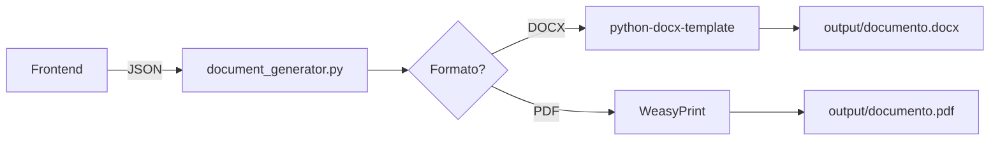

# Gráfica Profeplan 🖨️

## Propósito
A "Gráfica Especializada" do sistema. Gera documentos profissionais (DOCX/PDF) com qualidade de impressão usando templates do Word e renderização server-side.

## O Problema que Resolve

Gerar PDFs complexos no browser (client-side) tem limitações:
- ❌ Layout quebra facilmente
- ❌ Tabelas ficam feias
- ❌ Fontes inconsistentes
- ❌ Memória limitada do navegador

**Solução:** Renderização server-side com templates profissionais.

## O Que Esta Gráfica Faz

### 1. Templates DOCX Profissionais
- Baseados nos modelos oficiais da SEEMG
- Criados no Microsoft Word com formatação perfeita
- Usa placeholders como `{{ nome_aluno }}`, `{{ data }}`
- Preenchimento automático via Python

### 2. Geração DOCX
```
JSON (do Frontend) → python-docx-template → DOCX Pronto
```

### 3. Conversão para PDF (Quando Necessário)
```
DOCX → WeasyPrint (HTML) → PDF de Alta Qualidade
```

### 4. Tipos de Documentos Suportados

| Documento | Template | Formato Saída |
|-----------|----------|---------------|
| Planejamento Trimestral | `planejamento_trimestral.docx` | DOCX/PDF |
| Plano de Aula | `plano_aula.docx` | DOCX/PDF |
| PDI (Plano Individual) | `pdi_documento.docx` | DOCX/PDF |
| Relatório de Progresso | `relatorio_progresso.docx` | DOCX/PDF |

## Scripts Principais

| Script | Descrição |
|--------|-----------|
| `document_generator.py` | Serviço principal de geração |
| `docx_builder.py` | Builder específico para DOCX |
| `pdf_converter.py` | Conversor DOCX → PDF |
| `template_validator.py` | Valida templates antes de usar |

## Instalação

```bash
cd packages/graphics-profeplan
python -m venv venv
source venv/bin/activate  # Windows: venv\Scripts\activate
pip install -r requirements.txt
```

## Uso

### API Básica

```python
from src.document_generator import DocumentGenerator

# Inicializar
generator = DocumentGenerator()

# Dados do planejamento
data = {
    "escola": "EE Professor João Silva",
    "disciplina": "Matemática",
    "ano_serie": "6º Ano EF",
    "trimestre": "1º Trimestre",
    "unidades": [...]
}

# Gerar DOCX
docx_path = generator.generate(
    template="planejamento_trimestral",
    data=data,
    output_format="docx"
)

# Gerar PDF
pdf_path = generator.generate(
    template="planejamento_trimestral",
    data=data,
    output_format="pdf"
)
```

### Como Funciona



## Estrutura de Template

Exemplo de `planejamento_trimestral.docx`:

```
ESCOLA: {{ escola }}
DISCIPLINA: {{ disciplina }}
ANO/SÉRIE: {{ ano_serie }}

UNIDADES TEMÁTICAS:

  - {{ unidade.titulo }}
    Habilidades: {{ unidade.habilidades|join(', ') }}

```

## Contrato com a Loja

A Loja (`apps/web`) chama a Gráfica via API (futuro) ou script:

```bash
python src/document_generator.py \
  --template planejamento_trimestral \
  --data planningsrc/data.json \
  --output ./output/plano_final.docx
```

Ou integração direta no código TypeScript (via subprocess ou API REST).

## Considerações de Performance

- 📄 **DOCX**: ~0.5-1s por documento
- 📋 **PDF**: ~2-3s por documento (conversão adicional)
- 💡 **Cache**: Templates são carregados uma vez e reutilizados

---
**Esta gráfica roda on-demand (quando usuário solicita download) e entrega documentos perfeitos.**
